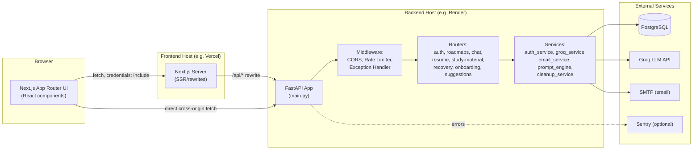
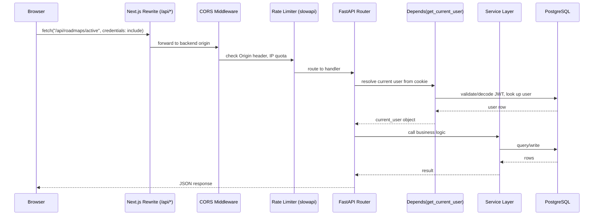

# Part 1 — Project Overview

> Part of the VazhiAI Engineering Knowledge Base. See [docs/README.md](./README.md) for the full table of contents.

## 1.1 What This Project Is (Simple Explanation)

Imagine a student, a working professional, and a job seeker all walk into the same app. Each of them wants the same thing — "tell me what to do next to reach my career goal" — but they need completely different advice. VazhiAI is a web application that:

1. Asks the user a few questions about who they are (student / professional / job seeker, their field, their goal, their experience level).
2. Uses an AI model to suggest 3–4 realistic career paths for them.
3. Once they pick one, generates a full day-by-day study plan (a "roadmap") using AI.
4. Lets them work through that plan day by day — reading resources, solving practice problems, taking quizzes, chatting with an AI mentor.
5. Also gives them a resume builder and an on-demand study-material generator, both AI-assisted.

In plain terms: it's a personalized, AI-driven tutor and career coach, delivered as a website with a Python backend and a React/Next.js frontend.

## 1.2 Technical Summary

VazhiAI is a **two-tier web application**:

- **Frontend**: A Next.js 14 (App Router) single-page-application-style client, written in TypeScript, styled with Tailwind CSS, animated with Framer Motion.
- **Backend**: A FastAPI (Python, async) REST API, backed by PostgreSQL via SQLAlchemy, with Alembic migrations, JWT-based cookie authentication, and Groq (Llama 3.3 70B) as the LLM provider for all AI features.

The two tiers communicate over HTTPS using JSON, with the frontend calling the backend through a typed API client (`lib/api.ts`). They are deployed independently — the frontend commonly on Vercel, the backend on Render (inferred from in-repo comments referencing both platforms) — which is a very standard "decoupled frontend + API backend" deployment shape for modern web apps.

## 1.3 High-Level System Design



**Why this shape?** Splitting frontend and backend into two independently deployable services (rather than one monolithic server-rendered app) is one of the most common patterns in modern web engineering because:

- The frontend can be deployed to a CDN-backed platform optimized for static/SSR content delivery (fast global page loads).
- The backend can scale independently based on API load (which is driven by LLM calls, not page views).
- Teams can work on frontend and backend independently with a clear contract (the REST API) between them.
- The backend can be reused by other clients later (a mobile app, a CLI, etc.) without changes.

**The trade-off**: this shape introduces cross-origin concerns (CORS, cookie domain scoping) that a single-server monolith wouldn't have. This project hit that trade-off directly — see the `middleware.ts` comment history: an edge-middleware cookie check was removed because the auth cookie is scoped to the backend's domain and literally cannot be read by frontend edge middleware running on a different domain. This is a real, common gotcha in decoupled deployments, and the project's current solution (client-side `AuthProvider` + `RouteGuard`, calling `/auth/me` directly against the backend) is the correct fix for that specific problem.

## 1.4 Alternative Architectures (and Why They Weren't Chosen)

| Alternative | What it would look like | Why not chosen here |
|---|---|---|
| **Monolith (Django/Rails-style, server-rendered)** | One server renders HTML directly, no separate API | Would simplify auth/cookies (same-origin), but loses the fast, app-like SPA experience and makes frontend/backend team separation harder |
| **Full Next.js (API routes only, no FastAPI)** | Use Next.js API routes for the whole backend, Node.js only | Would unify the language (TS everywhere), but Python has stronger, more mature libraries for this project's needs (SQLAlchemy/Alembic, Groq SDK maturity, Pydantic validation) and the team clearly has Python backend expertise |
| **Microservices (separate auth service, separate AI service, etc.)** | Split `auth`, `roadmaps`, `chat`, `resume` into independently deployed services | Massive operational overhead (service discovery, inter-service auth, distributed tracing) for a project at this scale — not justified until traffic/team size demands it. See Part 8 for more on this. |
| **BFF (Backend-for-Frontend) pattern** | A thin Next.js API layer that proxies to a "real" backend, hiding the backend URL entirely from the browser | Partially present already — `next.config.js` rewrites `/api/*` to the backend, giving same-origin-looking requests from the browser's perspective. Could be extended further; see Part 9 for the improvement path. |

This project's actual choice — **FastAPI backend + Next.js frontend, connected by a documented REST API** — is the industry-standard "two-tier" architecture for small-to-medium SaaS products, and is appropriate for its current scale.

## 1.5 Request Lifecycle (Bird's-Eye View)

Every authenticated API request follows this path (full detail in [Part 7](./05-auth-and-request-lifecycle.md)):



## 1.6 Folder Structure

```
VazhiAI/
├── backend/
│   ├── main.py                    # App entrypoint: FastAPI instance, middleware, lifespan, routers
│   ├── database.py                # Engine/session factory, table bootstrap
│   ├── db_models.py               # SQLAlchemy ORM models (the schema, in code form)
│   ├── constants.py               # Static domain/option lists (fields, career goals, etc.)
│   ├── limiter.py                 # slowapi rate limiter singleton + 429 handler
│   ├── logging_config.py          # Structured logging setup
│   ├── migrate.py                 # Standalone script: runs Alembic + fallback bootstrap
│   ├── alembic.ini                # Alembic configuration
│   ├── migrations/                # Alembic migration scripts (versioned schema changes)
│   ├── models/schemas.py          # Pydantic request/response schemas (the API's data contracts)
│   ├── routes/                    # One file per feature area — the "controllers"
│   │   ├── auth.py                # signup/login/refresh/logout/me/profile
│   │   ├── recovery.py            # forgot-password / verify-otp / reset-password
│   │   ├── onboarding.py          # profile completion + profile extension
│   │   ├── suggestions.py         # AI career suggestions
│   │   ├── chat.py                # chat refine / mentor chat / explore-paths
│   │   ├── roadmaps.py            # roadmap CRUD, day generation, progress, tests
│   │   ├── resume.py              # resume optimization
│   │   └── study_material.py      # AI study material generation/history
│   ├── services/                  # Business logic, isolated from HTTP concerns
│   │   ├── auth_service.py        # password hashing, JWT, cookies, refresh-token rotation
│   │   ├── email_service.py       # SMTP email dispatch (OTP delivery)
│   │   ├── groq_service.py        # All LLM calls, retries, JSON extraction/validation
│   │   ├── prompt_engine.py       # Builds domain-aware prompts sent to the LLM
│   │   └── cleanup_service.py     # Scheduled DB hygiene (expired tokens/OTPs)
│   └── tests/                     # pytest suite (auth, roadmaps, study material)
│
└── frontend/
    ├── app/                        # Next.js App Router — one folder per route
    │   ├── layout.tsx              # Root layout: providers (Theme, Auth, RouteGuard)
    │   ├── page.tsx                # Main authenticated roadmap/day-plan page
    │   ├── auth/                   # login, signup, forgot/reset password pages
    │   ├── onboarding/             # multi-step profile wizard
    │   ├── suggestions/            # AI suggestions + Explore Paths chatbot
    │   ├── home/, dashboard/       # progress dashboards
    │   ├── resume/                 # resume builder
    │   ├── study-material/         # study material generator
    │   ├── quiz/[day]/             # per-day MCQ quiz (dynamic route)
    │   ├── demo-course/            # public, unauthenticated preview
    │   ├── mentors/                # mentor network (UI shell, feature in progress)
    │   └── landing/, get-started/  # marketing/entry pages
    ├── components/                 # Shared React components (RouteGuard, ThemeToggle)
    ├── lib/                        # API client, auth context, theme context, constants, utils
    └── types/                      # Shared TypeScript interfaces mirroring backend schemas
```

**Why this structure?** Both sides use a **feature-grouped, layered structure**:

- Backend: `routes/` (HTTP layer) is kept thin and delegates to `services/` (business logic) — a lightweight version of the classic **Controller → Service** split (see Part 8 for the full design-pattern discussion; this is *not* a full Repository pattern, and Part 8 explains that gap and what adding one would look like).
- Frontend: `app/` mirrors the URL structure directly (Next.js convention), while `lib/` centralizes cross-cutting concerns (API calls, auth state, theme) so page components stay focused on UI.

## 1.7 Technology Stack at a Glance

| Concern | Technology | Version (pinned) |
|---|---|---|
| Frontend framework | Next.js (App Router) | 14.2.5 |
| Frontend language | TypeScript | ^5 |
| UI library | React | ^18 |
| Styling | Tailwind CSS | ^3.4.6 |
| Animation | Framer Motion | ^11.3.8 |
| Backend framework | FastAPI | 0.111.0 |
| ASGI server | Uvicorn | 0.30.1 |
| ORM | SQLAlchemy | 2.0.30 |
| Migrations | Alembic | 1.13.1 |
| Database | PostgreSQL (via psycopg2) | — |
| Validation | Pydantic | 2.7.4 |
| JWT | python-jose | 3.3.0 |
| Password hashing | bcrypt | 4.3.0 |
| Rate limiting | slowapi | 0.1.9 |
| Retry/backoff | tenacity | 8.4.1 |
| Scheduled jobs | APScheduler | 3.10.4 |
| Error monitoring | Sentry SDK | 2.7.1 |
| LLM provider | Groq (`llama-3.3-70b-versatile`) | groq SDK 0.9.0 |
| Testing | pytest | 8.2.1 |

## 1.8 What This Project Deliberately Does *Not* Use

Being honest about absence is as important as describing what's present — an interviewer will respect "we didn't need X because Y" far more than a vague answer.

| Not used | Why it's worth naming | When you'd introduce it |
|---|---|---|
| Redis / external cache | No caching layer exists yet; every request hits Postgres directly | When read-heavy endpoints (e.g. roadmap outline) show DB load under real traffic |
| Message queue (Celery/RQ/SQS) | Background AI generation uses FastAPI's built-in `BackgroundTasks`, which runs in-process | When you need retries-with-backoff for failed jobs, or need generation to survive a server restart |
| Docker / containers | The repo has no Dockerfile; deployment relies on the platform's native Python/Node buildpacks | When you need reproducible local dev environments or move to Kubernetes/ECS |
| CI/CD pipeline | No GitHub Actions/CI config found in the repo | The moment more than one developer touches this code — automated test runs on every PR are cheap insurance |
| WebSockets | All communication is request/response (HTTP), including chat — no live streaming of LLM tokens | If you want ChatGPT-style token-by-token streaming instead of "wait, then show full reply" |
| Microservices | Single backend service handles every feature area | Only once team size or scaling needs genuinely require independent deployability per feature |
| GraphQL | REST endpoints only | If frontend needs to compose many nested resources in one round-trip |
| Redux/Zustand/global state library | State is a mix of React Context (`AuthProvider`, `ThemeProvider`) and a tiny hand-rolled in-memory store (`lib/store.ts`) | If cross-page state complexity grows significantly beyond what Context comfortably handles |

## 1.9 Interview Questions — Part 1

**Q1: Why did you split this into a separate frontend and backend instead of one full-stack framework?**
A: To let each side scale and deploy independently, use the best tool for each job (Next.js for UI/SSR, FastAPI for async Python APIs and easy LLM integration), and keep a clean API contract that could support other clients later (mobile, CLI) without backend changes.

**Q2: What was the hardest cross-origin problem you solved, and how?**
A: Cookies set by the backend (on its own domain) are invisible to Next.js edge middleware running on the frontend's domain — cookies are domain-scoped. The fix was to stop relying on edge middleware for auth checks and instead do a direct cross-origin `fetch` with `credentials: "include"` from the browser to the backend (`GET /auth/me`), which does carry the cookie correctly, and gate routes client-side based on that result.

**Q3: If this had to scale to 100x traffic tomorrow, what's the first bottleneck?**
A: The LLM calls (Groq) themselves — they're the slowest, most expensive operation per request, already mitigated by moving heavy generation to background tasks. Second would be the single Postgres connection pool (`pool_size=5, max_overflow=10`), which would need to grow or move to a pooled connection proxy (e.g., PgBouncer) under real concurrent load.

**Q4: What would you change about this architecture for a "senior" version of this project?**
A: Introduce a proper task queue (Celery/RQ) instead of in-process `BackgroundTasks` for durability across restarts, add a CI pipeline running the existing pytest suite on every PR, and consider Redis caching for the roadmap outline/day-details reads once traffic justifies it. See Part 9 for the full list.

## 1.10 Key Takeaways — Part 1

- VazhiAI is a two-tier SPA + REST API application: Next.js (TypeScript) frontend, FastAPI (Python) backend, PostgreSQL database, Groq LLM for AI features.
- The architecture is a standard, appropriate choice for its current scale — not over-engineered with microservices/queues it doesn't yet need, but also missing some production staples (CI, Docker, a durable job queue) worth calling out honestly.
- Cross-origin cookie scoping was a real architectural lesson learned in this codebase — a good, concrete story to tell in interviews.
- Every backend request flows: CORS → rate limiter → router → auth dependency → service layer → database → JSON response.
