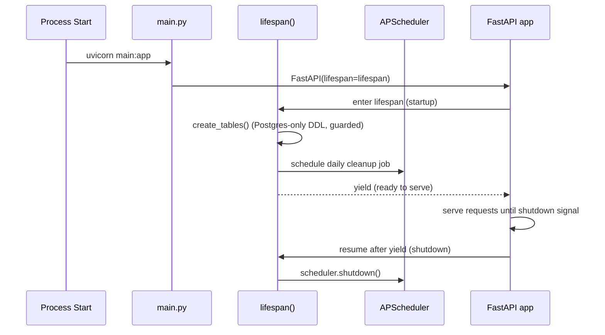
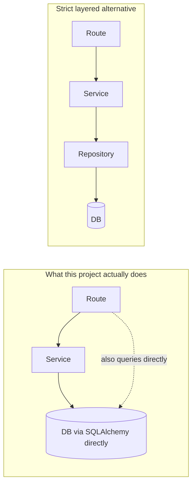
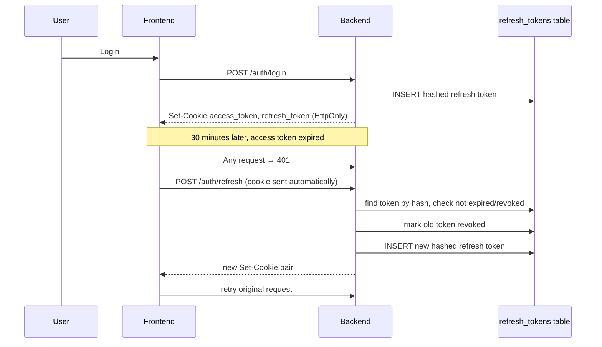

# Part 2 — Backend Documentation

> Part of the VazhiAI Engineering Knowledge Base. See [docs/README.md](./README.md) for the full table of contents.

## 2.1 File-by-File Reference

### Root-level files

| File | Purpose | Depends on | Interacts with |
|---|---|---|---|
| `main.py` | Application entrypoint. Creates the `FastAPI` app, wires middleware (CORS, rate limiter, global exception handler), registers all routers, and defines the `lifespan` (startup/shutdown) hook that bootstraps the DB and starts the cleanup scheduler. | `database`, `limiter`, all `routes.*`, `services.cleanup_service`, `logging_config`, `sentry_sdk` | Everything — it's the composition root |
| `database.py` | Creates the SQLAlchemy `engine` and `SessionLocal` factory; exposes `get_db()` (a FastAPI dependency that yields a session per request); contains `create_tables()`, a defensive fallback schema bootstrap that runs Postgres-only DDL statements. | `sqlalchemy`, `os.environ["DATABASE_URL"]` | Every route (via `Depends(get_db)`), `db_models.py` (shares `Base`) |
| `db_models.py` | Defines every database table as a Python class (SQLAlchemy ORM models): `User`, `UserProfile`, `Roadmap`, `DailyProgress`, `DailyTest`, `ChatMessage`, `OnboardingData`, `PasswordResetOTP`, `RefreshToken`, `StudyMaterial`. | `database.Base` | Every route and service that touches the DB |
| `constants.py` | Static, hardcoded option lists: educational statuses, fields/domains, career goals, experience levels, and a `DOMAIN_RESOURCES` dict mapping each field to relevant platforms/tools/focus areas. | none | `prompt_engine.py` (for domain context) |
| `limiter.py` | A single shared `slowapi.Limiter` instance (keyed by client IP), plus a custom 429 error handler. Can be globally disabled via `DISABLE_RATE_LIMIT` for tests. | `slowapi` | Imported by every route module that needs `@limiter.limit(...)` |
| `logging_config.py` | Configures the root Python logger: plain text or JSON format (toggle via `JSON_LOGGING`), quiets noisy third-party loggers. | `logging`, `json` | Called once, at import time, in `main.py` |
| `migrate.py` | A standalone CLI script (`python migrate.py upgrade`) that runs Alembic migrations, then calls `database.create_tables()` as a defensive fallback. Meant to run **before** the server starts. | `alembic`, `database` | Run manually or via `start.sh`/`start.bat` |
| `alembic.ini` / `migrations/` | Alembic's configuration and versioned migration scripts — the authoritative, industry-standard way this project evolves its schema over time. | `alembic` | `migrate.py` |
| `requirements.txt` | Pinned Python dependency versions. | — | `pip install` |

### `models/`

| File | Purpose |
|---|---|
| `models/schemas.py` | Every Pydantic model used for request validation and response serialization — the API's data contracts (its "DTOs" — see §2.4). Organized by feature: Auth, Onboarding, User Profile, Roadmap, Chat, Study Material. |

### `routes/` (the HTTP/Controller layer)

| File | Endpoints | Responsibility |
|---|---|---|
| `routes/auth.py` | `POST /auth/signup`, `POST /auth/login`, `POST /auth/refresh`, `POST /auth/logout`, `GET /auth/me`, `PUT /auth/profile` | Account creation, session issuance, session refresh/revocation, profile read/update |
| `routes/recovery.py` | `POST /auth/forgot-password`, `POST /auth/verify-otp`, `POST /auth/reset-password` | OTP-based password recovery, with brute-force lockout and anti-enumeration timing equalization |
| `routes/onboarding.py` | `POST /onboarding/complete`, `GET /onboarding/profile` | Saves the multi-step onboarding wizard's data to both the `User` row and the `UserProfile` extension table |
| `routes/suggestions.py` | `POST /generate-suggestions` | Calls the LLM to produce personalized career path suggestions |
| `routes/chat.py` | `POST /chat/refine-suggestions`, `GET /chat/history`, `POST /chat/message`, `POST /chat/explore-paths` | All conversational AI features: suggestion refinement, the roadmap-day mentor chat, and the Explore Paths roadmap-editing chatbot |
| `routes/roadmaps.py` | `POST /roadmaps`, `GET /roadmaps`, `GET /roadmaps/active`, `POST /roadmaps/active/confirm`, `POST /roadmaps/progress`, `GET /roadmaps/progress`, `POST /roadmaps/active/confirm-custom`, `GET /roadmaps/active/day/{n}`, `POST /roadmaps/active/progress`, `GET /roadmaps/active/progress`, `POST /roadmaps/active/tests`, `GET /roadmaps/active/tests` | The largest and most complex router: roadmap lifecycle, AI-driven outline/day generation (as background jobs), daily progress logging, MCQ test submission/scoring |
| `routes/resume.py` | `POST /resume/optimize` | Sends structured resume data to the LLM for ATS-oriented rewriting |
| `routes/study_material.py` | `POST /study-material/generate`, `GET /study-material/history`, `GET /study-material/{id}`, `DELETE /study-material/{id}` | AI-generated Markdown study guides, with per-user history |

### `services/` (the business-logic layer)

| File | Responsibility |
|---|---|
| `services/auth_service.py` | Password hashing/verification (bcrypt), JWT access-token creation/decoding, refresh-token issuance/rotation/revocation, HTTP-Only cookie helpers, and the `get_current_user` FastAPI dependency that every protected route relies on. |
| `services/email_service.py` | Builds the OTP email's HTML/plain-text bodies and sends them via SMTP in a background daemon thread (fire-and-forget, non-blocking). |
| `services/groq_service.py` | The only place that talks to the Groq LLM API. Wraps every call with a `tenacity` retry decorator, extracts/repairs JSON from LLM output, validates it against Pydantic schemas, and post-processes results (e.g., sanitizing practice-problem links, deduplicating repeated problems across a roadmap). |
| `services/prompt_engine.py` | Pure string-building functions — no I/O, no side effects — that construct the actual prompts sent to the LLM, tailored per field/domain and per user status (Student/Professional/Job Seeker). |
| `services/cleanup_service.py` | A scheduled job (registered in `main.py`'s `lifespan`) that deletes expired/revoked refresh tokens and expired/used OTPs past a retention window, preventing unbounded table growth. |

### `tests/`

| File | Covers |
|---|---|
| `tests/conftest.py` | Test fixtures: an isolated SQLite test database (created fresh per test session via `Base.metadata.create_all`, never via the Postgres-only `create_tables()`), a per-test rolled-back transaction, and a `TestClient` with DB session override. |
| `tests/test_auth.py` | Signup, login, duplicate email, wrong password, `/auth/me`, profile update, unauthenticated access |
| `tests/test_roadmaps.py` | Roadmap save/fetch/confirm, auth requirement |
| `tests/test_study_material.py` | Generation, validation errors, history, fetch/delete, ownership checks |

---

## 2.2 Server Initialization

**Simple explanation**: Before the app can answer any request, something has to "wake it up" — create the web server object, tell it what URLs it understands, connect it to the database, and start listening for connections. That's server initialization.

**Technical explanation**: `main.py` is the composition root. In order:

1. Load environment variables (`os.environ`, via `python-dotenv` in modules that need it).
2. Configure Sentry (if `SENTRY_DSN` is set) and structured logging.
3. Create the `FastAPI` app instance, passing an `asynccontextmanager`-based `lifespan` function (the modern replacement for the deprecated `@app.on_event("startup")` hook — this project was migrated to `lifespan` specifically because `on_event` is deprecated in FastAPI ≥0.93).
4. Inside `lifespan`, **before** `yield`: run the defensive `create_tables()` bootstrap, then start the `BackgroundScheduler` (APScheduler) that runs the token/OTP cleanup job daily. **After** `yield`: shut the scheduler down cleanly. Code before `yield` runs at startup; code after `yield` runs at shutdown — this is the standard async context-manager lifecycle pattern.
5. Register the rate limiter's state and its 429 exception handler.
6. Add the `CORSMiddleware`.
7. Register a catch-all `Exception` handler for anything unhandled.
8. `include_router(...)` for every feature router.



**Real-world analogy**: Opening a restaurant for the day — unlock the doors (create the app), turn on the ovens (connect to the DB), post today's schedule (register routes), and set a timer for closing cleanup (the scheduler) — all *before* the first customer (request) walks in.

**Why `lifespan` instead of `@app.on_event`?** `@app.on_event("startup"/"shutdown")` is deprecated as of FastAPI 0.93+ and will eventually be removed; it also only supports separate startup/shutdown functions with no shared state between them. `lifespan` is a single async generator function where local variables (like the `scheduler` object) are naturally shared between the startup and shutdown halves via closure — cleaner and forward-compatible.

**Common mistakes**:
- Running slow/blocking work (like a synchronous Alembic migration) directly inside an `async def` startup hook — this blocks the event loop before any request can be served. This project explicitly avoids that: migrations run via the separate `migrate.py` script *before* Uvicorn even starts (see `start.sh`/`start.bat`).
- Forgetting to shut down background resources (schedulers, connection pools) on shutdown, leaking threads/connections when the process is asked to exit gracefully (e.g., during a rolling deploy).

**Interview questions**:
- *Q: Why is DB migration not run inside the FastAPI startup event?* — Because it's a blocking, potentially slow operation, and running it inside `async def` code blocks the single-threaded event loop, delaying the first request. It's run as a separate step before the server process even starts.
- *Q: What's the difference between `@app.on_event` and `lifespan`?* — `on_event` is deprecated, splits startup/shutdown into two disconnected functions; `lifespan` is one async generator, giving natural access to shared state across both halves, and is the currently-recommended FastAPI pattern.

---

## 2.3 Routing & Controllers

**Simple explanation**: Routing is the app's "phone directory" — it maps an incoming URL + HTTP method (like `POST /auth/login`) to the specific Python function that should handle it.

**Technical explanation**: FastAPI's `APIRouter` is used per feature area (`routes/auth.py` defines `router = APIRouter(prefix="/auth", tags=["auth"])`), and each router is mounted onto the main `app` via `app.include_router(...)` in `main.py`. Each route function acts as a **controller** in MVC terms: it parses/validates the incoming request (via Pydantic + FastAPI's automatic body parsing), calls into the service layer for actual business logic, and shapes the HTTP response (status code, JSON body, cookies).

Example — `routes/auth.py`'s `login`:
```python
@router.post("/login")
@limiter.limit("10/minute")
def login(request: Request, body: LoginRequest, db: Session = Depends(get_db)):
    user = db.query(db_models.User).filter(db_models.User.email == body.email.lower()).first()
    if not user or not verify_password(body.password, user.hashed_password):
        raise HTTPException(status_code=401, detail="Invalid email or password")
    ...
    return _build_auth_response(user, access_token, refresh_token)
```
This function is thin: it does one DB lookup, delegates password verification and token creation to `auth_service`, and returns. That thinness is intentional — see §2.4.

**Advantages of one router file per feature**: easy to locate code for a feature, natural place to apply feature-specific middleware (e.g., rate limits), and each file stays small enough to read in one sitting.

**Disadvantages**: as features grow, a single router file (like `roadmaps.py`, the largest at ~570 lines) can become a dumping ground mixing multiple sub-concerns (roadmap CRUD, background-job orchestration, quiz scoring). A stricter structure would split these into `roadmaps/crud.py`, `roadmaps/generation.py`, `roadmaps/tests.py` as the file grows further.

**Alternatives**: class-based views (Django REST Framework style) instead of function-based routes; a single monolithic `routes.py` (worse at this scale); GraphQL resolvers instead of REST routes (see §2.19).

**Interview questions**:
- *Q: How does FastAPI know to parse the request body into `LoginRequest`?* — Because the parameter is type-annotated with a Pydantic model; FastAPI inspects the function signature at import time and automatically parses/validates the JSON body against that model before the function body runs.
- *Q: Why keep route functions thin?* — Testability (business logic can be unit-tested without spinning up HTTP), reusability (the same service function could be called from a background job or CLI script), and separation of concerns (HTTP status codes and cookie-setting are a different responsibility than "is this password correct").

---

## 2.4 Services Layer (and the Missing Repository Layer)

**Simple explanation**: If routes are the restaurant's waiters (taking orders, delivering food), services are the kitchen (doing the actual cooking/business logic). The waiter doesn't cook; they just relay.

**Technical explanation**: `services/*.py` hold logic that doesn't belong in an HTTP handler: hashing passwords, calling the LLM, sending email, running scheduled cleanup. Routes call into services; services generally don't know anything about HTTP (no `Request`/`Response` objects passed into them, with the exception of `request` being passed through in a few places for logging IP addresses — a minor layering leak worth noting).

**What's notably absent: a Repository layer.** In a strict layered architecture, you'd have three layers: **Controller → Service → Repository → Database**, where the Repository is the *only* code that knows how to write SQL/ORM queries, and the Service layer calls the Repository instead of querying the database directly. This project does **not** have that middle layer — routes and services both call `db.query(db_models.X)...` directly. For example, `routes/roadmaps.py` builds SQLAlchemy queries inline rather than calling something like `roadmap_repository.get_active_for_user(user_id)`.



**Why the project works fine without a Repository layer**: SQLAlchemy's ORM query API is already a reasonably strong abstraction over raw SQL, and the project is small enough that query logic duplication is manageable. Adding a Repository layer is most valuable when: (a) the same query logic is duplicated across many call sites, (b) you want to swap the underlying data store without touching business logic, or (c) you want to unit-test business logic with a fake in-memory repository instead of hitting a real database. None of those pressures are strong yet here.

**Trade-off if left unaddressed as the project grows**: query logic (e.g., "the active roadmap for a user" — `filter(user_id==X, is_active==True)`) is repeated across `roadmaps.py`, `chat.py`, and elsewhere. A repository method `get_active_roadmap(db, user_id)` would remove that duplication. This is flagged again in Part 8 (Design Patterns) and Part 9 (Improvements).

**Interview questions**:
- *Q: Does this project use the Repository pattern?* — No — routes and services query SQLAlchemy directly. This is a reasonable choice at the current scale, but a repository layer would reduce query-logic duplication (e.g., "get user's active roadmap" appears in multiple files) and make unit testing easier.
- *Q: Where would you add a Repository layer first?* — Around `Roadmap` queries specifically, since "the current user's active, confirmed roadmap" is looked up with the same three-clause filter in at least four different route functions.

---

## 2.5 Authentication & Authorization

**Simple explanation**: Authentication answers "who are you?" (proving identity, e.g., via a password). Authorization answers "what are you allowed to do?" (e.g., "can this user see *this specific* roadmap, or only their own?").

### 2.5.1 Password Hashing

Passwords are never stored in plain text. `auth_service.hash_password()` uses `bcrypt.gensalt()` + `bcrypt.hashpw()` — bcrypt is a slow, salted, adaptive hashing algorithm specifically designed to resist brute-force and rainbow-table attacks (unlike fast general-purpose hashes like MD5/SHA-256, which are *wrong* for passwords because their speed is a liability, not a feature, when an attacker is guessing).

- **Advantage**: bcrypt automatically generates a unique salt per password and has a configurable "cost factor" that can be increased over time as hardware gets faster.
- **Alternative**: Argon2 (winner of the 2015 Password Hashing Competition, generally considered the current best-practice choice for new projects) or scrypt. bcrypt remains extremely common and battle-tested, so it's a defensible, industry-standard choice, just not the newest one.
- **Security implication if done wrong**: storing plain-text or fast-hashed passwords means a single database leak instantly compromises every user's password (and, since people reuse passwords, likely other services too).

### 2.5.2 JWT (JSON Web Tokens)

**What it is**: A JWT is a self-contained, digitally signed token encoding claims (like `{"sub": "<user_id>", "exp": <timestamp>}`) as three base64 parts: `header.payload.signature`. The server can verify a JWT's authenticity (via the signature) without querying a database — the token itself proves the claims haven't been tampered with.

**How it works here** (`auth_service.py`):
```python
SECRET_KEY = os.environ.get("JWT_SECRET_KEY")
if not SECRET_KEY:
    raise RuntimeError("JWT_SECRET_KEY environment variable is not set...")
ALGORITHM = "HS256"

def create_access_token(data: dict, expires_delta=None) -> str:
    to_encode = data.copy()
    expire = datetime.now(timezone.utc) + (expires_delta or timedelta(minutes=30))
    to_encode.update({"exp": expire})
    return jwt.encode(to_encode, SECRET_KEY, algorithm=ALGORITHM)

def decode_token(token: str) -> Optional[dict]:
    try:
        return jwt.decode(token, SECRET_KEY, algorithms=[ALGORITHM])
    except JWTError:
        return None
```
Two things worth calling out as **best practice, done correctly here**:
1. `algorithms=[ALGORITHM]` is passed explicitly to `jwt.decode`, not left open — this prevents an "algorithm confusion" attack where a malicious client sends a token with `alg: none` or swaps to a different algorithm to bypass signature verification.
2. `JWT_SECRET_KEY` has **no hardcoded fallback** — the app refuses to start if it's not set, closing off a real vulnerability class where a forgotten env var silently falls back to a publicly-known default secret (this was an actual bug found and fixed during this project's security review — see Part 9).

**Real-world analogy**: A JWT is like a concert wristband stamped by a machine only the venue owns. Security staff can glance at the wristband and instantly know it's real (checking the stamp/signature) without calling the box office (database) every time — as long as no one can forge the stamp.

**Advantages**: stateless verification (no DB round-trip needed to check "is this token valid"), works well across multiple backend instances without shared session storage.
**Disadvantages**: a JWT can't be "revoked" before its expiry without extra infrastructure (a blocklist) — this is exactly why this project pairs short-lived JWT access tokens (30 min) with a separately-revocable refresh token (see §2.5.3).
**Alternatives**: opaque session tokens looked up in a server-side session store (Redis/DB) on every request — simpler to revoke instantly, but requires a DB/cache hit per request and doesn't scale as statelessly.

### 2.5.3 Refresh Tokens & Rotation

Access tokens are short-lived (30 minutes) by design — if stolen, the exposure window is small. But re-logging in every 30 minutes would be unusable, so a longer-lived **refresh token** (30 days) exists to silently mint new access tokens.

**How it works**:
- On login/signup, `create_refresh_token()` generates a cryptographically random string (`secrets.token_urlsafe(64)`), stores only its **SHA-256 hash** in the `refresh_tokens` table (never the raw value — so a database leak alone doesn't hand out usable tokens), and returns the raw token to be set as an HTTP-Only cookie.
- On `POST /auth/refresh`, `rotate_refresh_token()` looks up the hash, checks it's not expired/revoked, **immediately revokes it**, and issues a brand new access+refresh pair. This is **refresh token rotation**: every use invalidates the old token, so if a stolen refresh token is used by an attacker *and* later by the real user (or vice versa), the mismatch is detectable (the second user to try finds it already revoked) — a standard defense against refresh-token replay.
- On logout, `revoke_all_user_tokens()` marks every active refresh token for that user as revoked, logging out all sessions/devices at once.



### 2.5.4 Cookies vs. localStorage — Why HTTP-Only Cookies

Tokens are delivered as **HTTP-Only cookies**, not stored in `localStorage` and read by JavaScript. This is a deliberate, security-first choice:

| | HTTP-Only Cookie (used here) | localStorage (common but riskier) |
|---|---|---|
| Readable by JavaScript? | No | Yes |
| Vulnerable to XSS token theft? | No — even if an attacker injects a `<script>`, `document.cookie` can't read an HttpOnly cookie | Yes — any successful XSS can `localStorage.getItem("token")` and exfiltrate it |
| Automatically sent with requests? | Yes, by the browser | No — must be manually attached to every request's `Authorization` header |
| Needs CSRF protection? | Yes, if `SameSite` isn't strict | No |

This project's cookies are set with `httponly=True, secure=<True in prod>`. The `SameSite` attribute is set to `"none"` (not `"strict"`) specifically because the frontend and backend are on different domains (Vercel vs. Render) and a stricter setting would block the cookie from being sent on legitimate cross-origin requests. That trade-off reintroduces some CSRF exposure, currently mitigated by the CORS origin allowlist — this was flagged during the project's own security review as an area where a dedicated CSRF token would add defense-in-depth (see Part 9).

### 2.5.5 Authorization (Ownership Checks)

Authentication proves *who* you are; authorization enforces *what you can touch*. Every protected route depends on `get_current_user`, which resolves a `db_models.User` object from the cookie/token. From there, **every** query that returns user-owned data filters by `current_user.id` — e.g.:
```python
roadmap = db.query(db_models.Roadmap).filter(
    db_models.Roadmap.user_id == current_user.id,
    db_models.Roadmap.is_active == True,
).first()
```
This pattern — filtering by the authenticated user's ID in the `WHERE` clause of every query — is the project's core defense against **IDOR (Insecure Direct Object Reference)**, where a user could otherwise access another user's data just by guessing/incrementing an ID. This was specifically audited across every route in this project (see Part 9) and one gap was found and fixed: a client-supplied `roadmap_id` field was being trusted without an ownership check in one endpoint before the fix.

**Common mistakes with authorization** (industry-wide, several were caught here during review):
- Trusting a client-supplied foreign key (like `roadmap_id`) without verifying the current user actually owns that resource.
- Filtering the **list** endpoint by user ID correctly, but forgetting to filter the **single-item fetch/delete** endpoint the same way (a very common IDOR source — always check `GET /resource/{id}` and `DELETE /resource/{id}`, not just `GET /resource`).
- Returning internal fields (like `hashed_password`) in a response model because a schema was built from `SELECT *` instead of an explicit allowlist of fields.

**Interview questions**:
- *Q: Walk me through what happens when a JWT is stolen.* — An attacker has full access until the token expires (30 min max for the access token). They cannot get a *new* token without the refresh token, which is a separate, HttpOnly, path-scoped cookie (`path=/auth/refresh`) not exposed to JS either. If the refresh token is also stolen and used, rotation means the legitimate user's next refresh attempt will fail (token already revoked), which is a detectable signal of compromise.
- *Q: Why store a hash of the refresh token instead of the raw token in the database?* — So that a database leak alone doesn't hand out usable tokens — the attacker would need the raw token (which only ever existed in the cookie) to compute a matching hash.
- *Q: How would you explain IDOR to a non-technical client?* — "Imagine a hotel where every room uses the same physical key, and yours just happens to open room 204. If you could type in '205' and get into someone else's room, that's IDOR. We make sure every request checks not just 'is this a valid key' but 'does this key belong to *this* room.'"

---

## 2.6 Validation & DTOs (Pydantic Schemas)

**Simple explanation**: Before trusting anything a user sends you, check its shape and contents match what you expect — like a bouncer checking ID before letting someone in, not after.

**Technical explanation**: `models/schemas.py` defines Pydantic `BaseModel` classes for every request body and response shape — these are the project's **DTOs (Data Transfer Objects)**: plain data-holding classes whose only job is to define the contract at the API boundary, separate from the ORM models that represent database rows. Examples:
- `SignupRequest` validates `password_strength` (min 8 chars) via a `@field_validator`.
- `StudyMaterialRequest.validate_topics` enforces 1–5 topics, each 2–200 characters.
- `ChatMessageInput.content` uses `Field(..., max_length=4000)` to cap LLM-bound input size (added during the security review to control cost/prompt-injection surface).

**Why separate DTOs from ORM models?** If routes returned `db_models.User` objects directly, you'd either leak internal fields (like `hashed_password`) or be forced to bolt on serialization logic ad hoc. A dedicated `UserPublic` schema is an explicit **allowlist** of exactly which fields leave the system — safer by construction than an accidental-inclusion bug in a denylist approach.

**Common mistake fixed in this project**: mutable default arguments. Early versions had fields like `tech_stack: Optional[List[str]] = []` — while Pydantic v2 actually handles this safely (each instance gets its own copy), it's still considered a code smell that invites confusion with plain Python (`def f(x=[])` is a classic real bug in vanilla Python, since the same list object is shared across calls). The project was updated to use `Field(default_factory=list)` everywhere for clarity and defensive consistency.

**Interview questions**:
- *Q: What's a DTO and why not just return the database model?* — A DTO defines exactly what crosses the API boundary, independent of internal storage — preventing accidental leakage of sensitive/internal fields and decoupling the API contract from schema changes.
- *Q: Where does Pydantic validation happen in the request lifecycle?* — Before the route function body executes at all — FastAPI parses the JSON body into the annotated Pydantic type, running all validators; if validation fails, a `422 Unprocessable Entity` is returned automatically, and the handler code never even runs.

---

## 2.7 Error Handling & Exception Filters

**Simple explanation**: Things will go wrong — bad input, a third-party API timeout, a bug. The question is whether the user (and an attacker!) sees a clean, safe error message or your raw internal stack trace.

**Technical explanation**: Three layers of error handling exist:

1. **Expected errors** — routes raise `HTTPException(status_code=..., detail="...")` for known failure cases (wrong password, not found, etc.). FastAPI converts these into a clean JSON error response.
2. **A global catch-all handler** in `main.py`:
```python
@app.exception_handler(Exception)
async def global_exception_handler(request: Request, exc: Exception):
    request_id = str(uuid.uuid4())
    logger.exception("UNHANDLED_EXCEPTION | request_id=%s | %s %s | error=%s", request_id, request.method, request.url.path, repr(exc))
    return JSONResponse(status_code=500, content={"detail": "Internal server error. Please try again later.", "request_id": request_id})
```
This is the project's **exception filter** (in ASP.NET/Nest.js terminology) — it guarantees that *no* unhandled exception ever leaks a Python stack trace or internal detail to the client. Instead, the client gets a generic message plus a `request_id` they can quote in a support ticket, while the *full* details are logged server-side (and reported to Sentry if configured) for debugging.
3. **Per-route sanitized error messages** — several routes (`chat.py`, `study_material.py`, `resume.py`) explicitly catch exceptions and log the real error via `logger.exception(...)` while returning a fixed, generic `detail` string to the client. This was tightened during the security review — earlier code included `f"...{str(e)}"` directly in some `HTTPException` details, which could leak internal exception text (e.g., a database error message revealing table/column names).

**Why this matters (security)**: Detailed error messages are a reconnaissance goldmine for attackers — a stack trace can reveal file paths, library versions, or even fragments of SQL. **Information disclosure via error messages** is its own entry in the OWASP Top 10-adjacent guidance for a reason.

**Interview questions**:
- *Q: Why include a `request_id` in the generic error response?* — It lets you correlate a user's bug report ("I got an error at 3:15pm") with the exact log line and stack trace server-side, without ever exposing that stack trace to the client.
- *Q: What's the difference between an expected `HTTPException` and the global handler?* — `HTTPException` is a deliberate, anticipated failure path with an appropriate status code and safe message written by the developer. The global handler is a safety net for *unanticipated* bugs, ensuring even those never leak internals.

---

## 2.8 Logging

`logging_config.py` configures Python's standard `logging` module once, at startup: a single `StreamHandler` to stdout, either plain-text (`timestamp | LEVEL | logger.name | message`) or structured JSON (`JSON_LOGGING=true`, for log aggregation platforms that parse JSON logs). Each module gets its own named logger (`logging.getLogger("VazhiAI.auth")`, etc.), which makes it possible to filter/search logs by subsystem.

**Why JSON logging matters at scale**: plain text logs are fine to read by eye locally, but once you have a real logging platform (Datadog, CloudWatch, ELK), structured JSON lets you filter/query by field (`level:ERROR AND logger:VazhiAI.auth`) instead of grepping strings.

**Best practice followed here**: security-sensitive events (`LOGIN_FAILED`, `OTP_VERIFY_WRONG_CODE`, `BRUTE_FORCE_LOCKED`, `REFRESH_TOKEN_ROTATED`) are logged with structured key=value pairs including the client IP — this is exactly the kind of audit trail you'd want when investigating a suspected account-takeover attempt later.

**Common mistake avoided**: never logging secrets. This codebase logs user IDs and IPs, never passwords, tokens, or OTP codes themselves.

---

## 2.9 Dependency Injection

**Simple explanation**: Instead of a function creating everything it needs itself, someone else "hands it" what it needs — like a chef being handed pre-washed vegetables instead of growing their own garden.

**Technical explanation**: FastAPI's `Depends()` is its dependency injection mechanism. Every protected route declares `current_user: db_models.User = Depends(get_current_user)` and `db: Session = Depends(get_db)` as parameters — FastAPI resolves these automatically before calling the route function, including resolving *nested* dependencies (`get_current_user` itself depends on `get_db`).

```python
def get_db():
    db = SessionLocal()
    try:
        yield db
    finally:
        db.close()

def get_current_user(request: Request, credentials=Depends(bearer_scheme), db: Session = Depends(get_db)) -> db_models.User:
    ...
```

**Why this matters**: it makes route functions declarative about their requirements ("I need a DB session and an authenticated user") without manually wiring object construction inside every function, and it makes testing trivial — `tests/conftest.py` overrides `get_db` with `app.dependency_overrides[get_db] = override_get_db` to swap in a test database session, with zero changes to route code.

**Advantages**: testability, explicit dependencies visible in function signatures, automatic cleanup (the `yield`-based `get_db` guarantees `db.close()` runs even if the route raises).
**Alternatives**: a global/singleton database session (bad — not safe across concurrent requests), manually instantiating a session inside every route (repetitive, harder to test).

**Interview questions**:
- *Q: How does `get_db` guarantee the session is closed even if the route raises an exception?* — It's a generator function; the `finally: db.close()` block runs regardless of whether the code after `yield` (the route handler) completes normally or raises, because Python guarantees `finally` blocks execute during generator cleanup.
- *Q: How do tests substitute a different database without changing route code?* — `app.dependency_overrides[get_db] = override_get_db` — FastAPI's DI system checks this override dict before falling back to the real dependency function.

---

## 2.10 Configuration & Environment Variables

All secrets and environment-specific values are read via `os.environ.get(...)`, loaded from a `.env` file via `python-dotenv`'s `load_dotenv()`. Two patterns are used side by side, and the difference matters:

- **Fail-fast, no default** (correct for secrets): `DATABASE_URL` and `JWT_SECRET_KEY` both raise a `RuntimeError` at import time if unset — the app refuses to start in a misconfigured, insecure state rather than silently running with a dangerous default.
- **Sensible default provided** (correct for non-secrets): `ACCESS_TOKEN_EXPIRE_MINUTES`, `ALLOWED_ORIGINS` (defaults to `localhost:3000` for local dev), `ENVIRONMENT` (defaults to `"development"`, keeping API docs enabled unless explicitly set to `"production"`).

**Why the distinction matters (security)**: a missing secret with a hardcoded fallback is a classic vulnerability — this project actually had exactly that bug (`JWT_SECRET_KEY` had a hardcoded fallback string) found and fixed during its security review. The fix follows the same "fail fast" pattern `database.py` already used for `DATABASE_URL`.

**Best practice**: `.env` is listed in `.gitignore` so real secrets never enter version control; `.env.example` documents variable *names* without real values, so a new developer knows what to configure without ever seeing a production secret.

---

## 2.11 Database Connection & ORM

See Part 3 for the full schema. At the connection level, `database.py`:
```python
engine = create_engine(
    DATABASE_URL, pool_pre_ping=True, pool_recycle=300,
    pool_size=5, max_overflow=10, pool_timeout=30,
)
SessionLocal = sessionmaker(autocommit=False, autoflush=False, bind=engine)
```
- `pool_pre_ping=True`: before handing out a pooled connection, SQLAlchemy pings it — protects against using a connection the database has silently dropped (common with managed Postgres providers that close idle connections).
- `pool_recycle=300`: connections older than 5 minutes are recycled, for the same reason.
- `pool_size=5, max_overflow=10`: at most 15 concurrent DB connections from a single process — small and safe for the project's current traffic, but the first thing to revisit under real concurrent load (see Part 9).

**ORM (SQLAlchemy)** maps Python classes (`db_models.User`) to database tables, letting code write `db.query(User).filter(User.id == x).first()` instead of hand-writing SQL strings. This is also the project's primary **SQL injection defense** — every query uses the ORM's parameterized query building, never raw string interpolation of user input into SQL (the one place raw SQL text() is used is the fixed, developer-authored migration DDL in `create_tables()`, which never includes user input).

**Advantages of an ORM**: SQL injection protection by default, database-agnostic code (mostly), less boilerplate.
**Disadvantages**: can generate inefficient queries if used carelessly (the classic **N+1 query problem** — see below), a leaky abstraction when you need DB-specific features.
**Alternatives**: raw SQL with a query builder (e.g., SQLAlchemy Core without the ORM layer), or a different ORM (Django ORM, Tortoise ORM for async-native).

**N+1 queries**: this project is largely free of the classic N+1 pattern (looping over a list and querying inside the loop) because most list endpoints fetch already-denormalized JSON columns (e.g., `Roadmap.outline` is a single JSON blob, not a separate table requiring a join per row) rather than relational child tables queried in a loop.

---

## 2.12 Transactions

**Simple explanation**: A transaction is "all or nothing" — like a bank transfer that either both debits your account and credits mine, or does neither; it never does just one half.

**Technical explanation**: SQLAlchemy's `Session` batches changes and only persists them on `db.commit()`; `db.rollback()` discards uncommitted changes. This project relies on this implicitly in most routes (a single `db.commit()` per request), and explicitly manages rollback in error paths — e.g., `bg_generate_outline` in `roadmaps.py`:
```python
try:
    ...
    db.commit()
except Exception as e:
    db.rollback()
    db.close()
    # open a NEW session for the recovery write — the rolled-back
    # session's identity map may be stale, so reusing it is unreliable
    recovery_db = SessionLocal()
    ...
```
This "open a fresh session after rollback" pattern was a specific bug fix during this project's review: reusing the same session immediately after `rollback()` to write a "generation failed" status was unreliable, since the session's internal object cache can be left in an inconsistent state. Opening a new session for the recovery write is the safe, correct pattern.

**Row-level locking**: `get_roadmap_day` uses `.with_for_update()` when reading a roadmap before deciding whether to schedule background generation for a given day — this issues a `SELECT ... FOR UPDATE`, taking a row lock until the surrounding transaction commits. Without it, two near-simultaneous requests for the same not-yet-generated day could both read "not processing" and both schedule duplicate background generation. This is a textbook **race condition fix via database-level locking** — a common interview topic.

**Interview questions**:
- *Q: What problem does `.with_for_update()` solve here, concretely?* — Two concurrent requests hitting "give me Day 5" before it's generated could both see `days_status["5"] != "processing"` and both kick off a duplicate (wasteful, and possibly conflicting) background generation job. The row lock ensures the second request's read happens only after the first request's write commits.
- *Q: Why not just reuse the session after `rollback()`?* — After a rollback, SQLAlchemy's session identity map (its in-memory cache of loaded objects) can be in an inconsistent state relative to the database; querying and committing again on the same session is unreliable. A fresh session guarantees a clean read.

---

## 2.13 Caching

**Not used in this project.** There is no Redis, no in-memory cache layer, no HTTP cache headers strategy beyond what Next.js/browsers do automatically for static assets. Every API request hits PostgreSQL (and, for AI features, the Groq API) directly.

**When you'd add it**: if the roadmap outline or day-details endpoints (which return large, rarely-changing JSON blobs once generated) show meaningful read load, a cache-aside pattern (check Redis first, fall back to Postgres, populate cache on miss) would cut database load significantly with minimal code change, since that data is already immutable once generated.

---

## 2.14 Background Jobs

Two different mechanisms are used, deliberately, for two different needs:

1. **FastAPI `BackgroundTasks`** — for per-request, fire-and-forget work that should happen *after* the response is sent but doesn't need to survive a server restart: AI roadmap-outline generation, AI day-details generation. The client gets an immediate `202 Accepted` and polls for completion.
2. **APScheduler `BackgroundScheduler`** — for a recurring, time-based job independent of any single request: the daily expired-token/OTP cleanup, registered once in `main.py`'s `lifespan` and running in its own background thread for the life of the process.

**Why not a "real" task queue (Celery/RQ) for both?** `BackgroundTasks` is simpler (no extra infrastructure — no Redis/broker needed) and sufficient for this project's current scale, but it has a real limitation: if the server process crashes or restarts mid-generation, the job is silently lost (no retry, no persistence). This was explicitly flagged during the project's scalability review as a known trade-off, not an oversight — the fix (a durable queue like Celery+Redis or RQ) is a deliberate future step once traffic/reliability requirements justify the added operational complexity.

**Interview questions**:
- *Q: What happens if the server restarts while a roadmap is generating?* — With the current `BackgroundTasks` approach, that in-flight job is lost — the roadmap stays stuck in `generation_status="processing"` with no automatic retry. This is a known, accepted trade-off at current scale; the fix is migrating to a durable task queue.
- *Q: Why use APScheduler instead of a Linux cron job for the cleanup task?* — To avoid a second deployable/configurable piece of infrastructure — the schedule lives in the same codebase, deploys with the app, and requires no separate cron setup on the host. The trade-off is that it only runs while the app process is alive, and would double-fire if you ever ran multiple worker processes (harmless here since the job is idempotent — deleting already-deleted rows is a no-op).

---

## 2.15 File Uploads

**Not used.** Resume data is submitted as structured JSON (`Dict[str, Any]`), not a file upload (e.g., no PDF/DOCX parsing). `python-multipart` is present in `requirements.txt` (a dependency FastAPI needs for form/file upload support) but no route currently uses `UploadFile`.

**If this were added** (e.g., "upload your existing resume PDF and we'll parse it"): you'd need file-type validation (checking the actual file signature/magic bytes, not just the extension, since extensions are trivially spoofable), file-size limits, virus/malware scanning for anything stored and later served to other users, and storing files in object storage (S3-compatible) rather than the application server's local disk (which doesn't survive redeploys on most PaaS hosts anyway).

---

## 2.16 Email Services

`services/email_service.py` sends the password-reset OTP via SMTP (`smtplib`), building both an HTML email (branded, styled) and a plain-text fallback for clients that don't render HTML. Key design points:

- **Non-blocking dispatch**: `_dispatch_in_thread` runs the actual SMTP call in a daemon thread, so a slow/failing mail server never delays the API response to the user.
- **Fail-open by design in dev**: if `SMTP_USER`/`SMTP_PASS` aren't configured, the function logs the OTP and returns instead of crashing — convenient for local development, but this must never happen in production (if it did, no real user would ever receive their OTP).
- **Errors are logged, and reported to Sentry if configured**, but never surfaced to the API response — this is intentional: the `/auth/forgot-password` endpoint always returns the same generic message regardless of whether the email exists or whether delivery actually succeeded, specifically to prevent an attacker from using response differences to enumerate registered email addresses.

**Trade-off**: because failures aren't surfaced to the user, a misconfigured SMTP server fails silently from the user's perspective ("I never got my OTP email") — mitigated by Sentry alerting, but a legitimate area for future improvement (e.g., a retry queue) once the reliability bar needs to be higher.

---

## 2.17 APIs, REST Principles, Versioning, Pagination, Search/Filter/Sort

**REST principles applied**: resources are represented by nouns in the URL (`/roadmaps`, `/study-material/{id}`), HTTP methods carry the verb (`GET` = read, `POST` = create/action, `DELETE` = remove), and status codes are meaningful (`201 Created` on study-material generation, `202 Accepted` for "started, check back later" on background-job endpoints, `204 No Content` on delete, `404` for missing/not-owned resources, `429` for rate-limit breaches).

**Versioning**: **not used** — there is no `/v1/` prefix or header-based versioning. For a single-frontend, single-backend project deployed together, this is a reasonable simplification (frontend and backend are always in lockstep). It becomes necessary the moment you have external API consumers, or multiple frontend versions in production simultaneously that expect different response shapes.

**Pagination**: partially present, not systematic. `GET /roadmaps/progress` and `GET /chat/history` cap results with `.limit(30)` / `.limit(200)` respectively (added during the scalability review to prevent unbounded payloads), but neither implements true cursor/offset pagination (no `?page=` or `?cursor=` parameter, no "next page" link in the response). `GET /study-material/history` similarly caps at `.limit(50)`.

**Search/Filtering/Sorting**: minimal — most list endpoints are implicitly filtered by "belongs to the current user" and ordered by recency (`order_by(created_at.desc())`); there's no generic query-parameter-driven filter/sort system (no `?sort=score&order=desc`).

**When to add real pagination**: the moment any of these lists could realistically exceed a few hundred rows per user in production — a `.limit(30)` cap silently hides older data rather than paginating to it, which is a UX gap worth fixing before it surprises a long-time user.

---

## 2.18 Rate Limiting

**What it is**: capping how many requests a client can make in a time window, to prevent abuse (brute-force login attempts, scraping, runaway costs on paid LLM calls).

**How it's implemented**: `slowapi` (a Flask-Limiter-inspired library for FastAPI/Starlette), keyed by client IP (`get_remote_address`). Limits are applied per-route via a decorator:
```python
@router.post("/login")
@limiter.limit("10/minute")
def login(...): ...
```
Every authentication-sensitive route (`login`, `signup`, `forgot-password`, `verify-otp`, `reset-password`, `logout`) and every LLM-backed route (`generate-suggestions`, `chat/*`, `resume/optimize`, `study-material/generate`) carries a limit — the LLM-backed limits were specifically added during the security review, since unthrottled access to a paid LLM API is a direct cost/DoS exposure, not just a UX concern.

**Known limitation, explicitly documented in-code**: `limiter.py`'s `Limiter` has no `storage_uri` configured, meaning it defaults to **in-memory, per-process** counters. If this app ever runs with multiple Uvicorn workers or multiple server instances, each process enforces its own independent quota — effectively multiplying every limit by the number of processes. The fix (a shared Redis-backed `storage_uri`) was deliberately deferred as an infrastructure decision requiring a new dependency (Redis), not made blindly during the code-only review pass.

**Real-world analogy**: a nightclub bouncer who only remembers faces from the current shift — if three bouncers work three separate doors with no shared logbook, someone rejected at door 1 can just walk to door 2.

**Interview questions**:
- *Q: Why keyed by IP instead of by user ID?* — Because rate limiting must also protect *unauthenticated* endpoints (login, signup) where there's no user ID yet — IP is the only identifier available before authentication succeeds.
- *Q: What breaks if you scale this to multiple worker processes today?* — Rate limits become effectively `N ×` more permissive than configured, since each process keeps its own in-memory counter with no shared state.

---

## 2.19 Security Deep Dive

### Encryption vs. Hashing
- **Hashing** (one-way, used for passwords via bcrypt, and for refresh tokens via SHA-256 before DB storage): you can verify a match but never recover the original value. Correct choice for passwords/tokens, where you only ever need to *check* a value, never *retrieve* it.
- **Encryption** (two-way, reversible with a key): **not used** in this codebase for stored data — there's no field-level encryption of, say, resume content or chat history at rest. Transport-level encryption (HTTPS/TLS) is assumed to be handled by the hosting platform, which is standard practice.

### CORS (Cross-Origin Resource Sharing)
Configured in `main.py` via `ALLOWED_ORIGINS` (comma-separated env var, defaulting to `localhost:3000` for dev), with `allow_credentials=True` (required for cookies to be sent cross-origin) and `allow_methods=["*"], allow_headers=["*"]`. FastAPI's `CORSMiddleware` inherently refuses to combine `allow_origins=["*"]` with `allow_credentials=True` (browsers forbid it too) — so this configuration is safe by construction as long as `ALLOWED_ORIGINS` in production lists only the real frontend domain(s).

### CSRF (Cross-Site Request Forgery)
Since auth relies on cookies (automatically attached by the browser to any request to the backend's domain, from any site), CSRF is a real concern. Current mitigations: the CORS origin allowlist (a malicious site's JS can't read the response even if the request succeeds, though CORS doesn't stop the request from *firing*), and the fact that requests use `Content-Type: application/json` which triggers a CORS preflight `OPTIONS` check the attacker's origin must pass. **Not currently implemented**: an explicit CSRF token (double-submit cookie or synchronizer token pattern) — flagged as a recommended defense-in-depth addition during the security review, not yet built, precisely because it also requires frontend changes to attach the token.

### XSS (Cross-Site Scripting)
Backend: all Pydantic-validated fields are just data, never rendered as HTML server-side. Frontend: user- and LLM-generated content is rendered via `dangerouslySetInnerHTML` in a couple of chat views — the project explicitly HTML-escapes (`&`, `<`, `>`) before applying its lightweight Markdown-to-HTML regex replacements, specifically to prevent injected `<script>` tags from an adversarial LLM response (a genuine prompt-injection-to-XSS chain) from executing. One such spot was found *missing* this escaping during the security review and was fixed to match the safer pattern already used elsewhere in the codebase.

### SQL Injection
Prevented structurally by using the SQLAlchemy ORM's parameterized query building everywhere user input reaches the database — there is no string-concatenated SQL anywhere in the request-handling path (the only raw `text()` SQL is developer-authored, static migration DDL with no user input involved).

### WebSockets, Microservices, Docker, CI/CD
None of these are used in this project (see §1.8 for the full "what's absent and why" table). In short: all communication is request/response HTTP (no live streaming), it's a single deployable backend service (no service mesh), there's no Dockerfile (relies on the hosting platform's native buildpacks), and there's no CI pipeline (tests exist and pass, but nothing currently runs them automatically on push/PR).

**Interview questions**:
- *Q: Explain your CSRF exposure and why it exists.* — Cross-domain frontend/backend deployment requires `SameSite=None` cookies (a stricter setting would block legitimate cross-origin requests entirely), which reopens some CSRF surface that `SameSite=Strict` would otherwise close. It's currently mitigated by CORS origin restrictions, with an explicit CSRF token flagged as the next hardening step.
- *Q: How do you know this app is safe from SQL injection?* — Because no code path builds SQL by string-concatenating user input; every query goes through SQLAlchemy's ORM, which parameterizes values automatically.

---

## 2.20 Key Takeaways — Part 2

- The backend follows a **Router (controller) → Service → Database** layering, missing an explicit Repository layer — a reasonable simplification at current scale, with a clear path to add one if query duplication grows.
- Authentication is JWT-based with HTTP-Only cookies, short-lived access tokens, rotating revocable refresh tokens, and bcrypt password hashing — a solid, industry-standard design.
- Authorization is enforced by filtering every query on `current_user.id`; this was specifically audited project-wide and one gap (an unchecked client-supplied foreign key) was found and fixed.
- Configuration follows a "fail fast on missing secrets, sensible defaults for everything else" pattern.
- Rate limiting, structured logging, and a global exception handler are all in place; the biggest documented gaps are the in-memory (not distributed) rate limiter and the non-durable (`BackgroundTasks`-based) job system — both are known, intentional trade-offs, not oversights.
- No caching layer, task queue, Docker, CI, WebSockets, or microservices exist yet — all reasonable absences at this project's current scale, each with a clear "when you'd add this" trigger.
