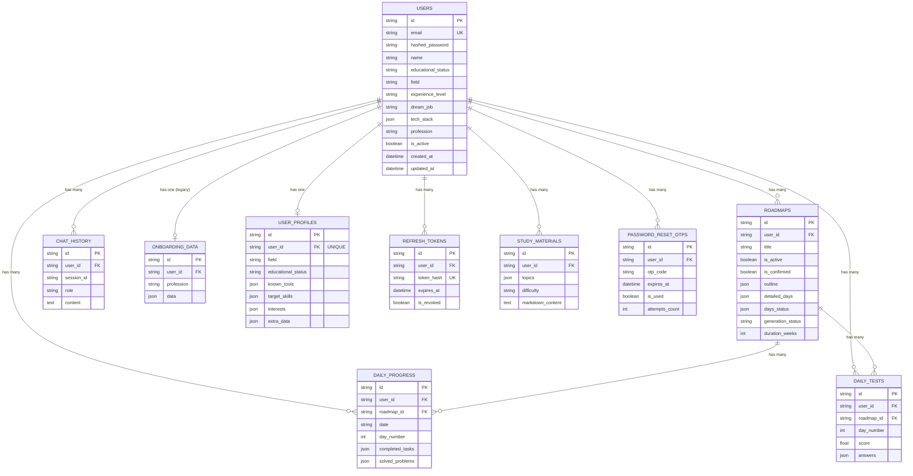
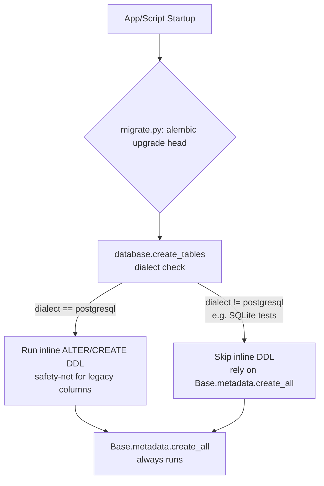

# Part 3 — Database Documentation

> Part of the VazhiAI Engineering Knowledge Base. See [docs/README.md](./README.md) for the full table of contents.

## 3.1 Simple Explanation

Think of the database as a set of labeled filing cabinets. Each cabinet (**table**) holds one kind of thing — users, roadmaps, chat messages. Each drawer (**row**) is one specific instance (one user, one roadmap). Each row has labeled fields (**columns**) like name, email, or creation date. Some drawers reference other cabinets by ID — a roadmap's drawer has a sticky note saying "belongs to user #4821" (a **foreign key**) — so the system always knows whose roadmap it is.

## 3.2 Entity-Relationship Diagram

## 3.3 Tables in Detail

### `users`
The central table. Holds authentication data (`email`, `hashed_password`) and a broad set of profile fields directly on the row (`educational_status`, `field`, `experience_level`, `dream_job`, student-specific columns, professional-specific columns). `tech_stack` is a `JSON` column storing a list of strings rather than a normalized child table.

**Design decision — why profile fields live directly on `users` instead of only in `user_profiles`**: the most universally-needed fields (name, field, educational status, dream job) are on `users` for fast, join-free access on every authenticated request (`get_current_user` already loads the `User` row; no extra query needed to know the user's field). The `user_profiles` extension table holds the more specialized, domain-specific, list-shaped data (known tools, target skills, certifications) that isn't needed on every request. This is a deliberate **partial denormalization** for read performance, at the cost of some column duplication (`field`, `dream_job`, `educational_status`, `experience_level` exist on both tables) — a documented trade-off, not an oversight (see `CHANGES.md`'s description of this exact design).

### `user_profiles`
A one-to-one extension of `users`, enforced by a `UNIQUE` constraint + index on `user_id`. Stores flexible, list/JSON-shaped domain data: `known_tools`, `target_skills`, `interests`, `certifications_done/target`, plus an `extra_data` catch-all JSON column for future fields without a migration.

### `roadmaps`
The core "product" table. One row per generated roadmap; `is_active` marks the user's currently-selected one (only one active roadmap per user at a time — enforced in application code, not a DB constraint — see §3.6). `outline` (JSON array of day summaries) and `detailed_days` (JSON object keyed by day number) store the AI-generated curriculum. `generation_status` / `days_status` track the async background-generation state machine (`pending` → `processing` → `completed`/`failed`, per-day).

**Why JSON columns instead of normalized child tables for `outline`/`detailed_days`?** Each day's content (resources, practice problems, MCQs, assignment) is a nested, LLM-generated blob whose exact shape can evolve without a migration, and it's always read/written as a whole unit (never queried "give me all days with an MCQ about X" across roadmaps) — so a JSON blob is simpler and just as fast here as a set of normalized tables would be, without the migration churn every time the LLM's output shape changes slightly. The trade-off: you lose the ability to query/index *inside* that JSON efficiently (e.g., "find all roadmaps mentioning topic X") — acceptable since that query need doesn't exist in this product.

### `daily_progress` / `daily_tests`
Per-day tracking: `daily_progress` for checklist/notes, `daily_tests` for MCQ scores. Both reference `user_id` **and** `roadmap_id`, so progress correctly scopes to a specific roadmap (a user could, in principle, have historical progress across multiple past roadmaps).

### `chat_history`
Every message (`role`: `"user"`/`"assistant"`) in the roadmap-day mentor chat, scoped by `user_id` and an optional `session_id`.

### `onboarding_data`
A **legacy** table, explicitly preserved for backward compatibility per `CHANGES.md`, superseded by `user_profiles` for new onboarding data. Recently given a `UNIQUE` constraint on `user_id` (previously missing, despite the ORM relationship declaring `uselist=False` — a mismatch between the ORM's assumption and what the database actually enforced, found and fixed during the security/scalability review).

### `refresh_tokens`
Stores only the **SHA-256 hash** of each refresh token, never the raw value (§2.5.3). Includes `user_agent`/`ip_address` for session visibility (e.g., a future "log out other devices" feature), and `is_revoked` for the rotation/logout mechanism.

### `password_reset_otps`
One row per OTP request; `attempts_count` enables brute-force lockout, `verified_at` gates the reset-password step to a short window after successful OTP verification.

### `study_materials`
One row per AI-generated study guide, storing the full Markdown output plus the generation parameters used, so history can be replayed/reviewed.

## 3.4 Primary Keys, Foreign Keys, Indexes

- **Primary keys**: every table uses a client-generated `String` UUID (`gen_uuid()` = `str(uuid.uuid4())`) rather than an auto-incrementing integer.
  - **Why UUIDs over auto-increment integers?** UUIDs are non-sequential and non-guessable, which meaningfully raises the bar against IDOR-style ID-guessing attacks (an attacker can't simply try `/study-material/1`, `/study-material/2`, ... to enumerate other users' resources) — a genuine security benefit beyond just style. The trade-off: UUIDs are larger (16 bytes vs. 4/8), slightly slower to index than sequential integers, and — as plain `String` UUIDs (not Postgres's native `UUID` type) — this project stores them as text, which is simpler to work with across dialects (Postgres and the SQLite test database) but slightly less storage/index-efficient than a native `UUID` column type would be.
- **Foreign keys**: consistently declared with `ForeignKey("users.id")`, several with `ondelete="CASCADE"` (e.g., `refresh_tokens`, `password_reset_otps`, `onboarding_data`, `user_profiles`) — deleting a user automatically cleans up their dependent rows at the database level, rather than relying on application code to remember to do so (a good practice: referential integrity enforced by the DB, not just by convention).
- **Indexes**: `index=True` on every foreign key column used in `WHERE` clauses (`user_id` on nearly every table, `roadmap_id` on progress/tests, `session_id` on chat), plus partial indexes for common filtered queries — e.g., `idx_refresh_tokens_user ON refresh_tokens(user_id) WHERE is_revoked = FALSE` and `idx_reset_otps_user_active ON password_reset_otps(user_id) WHERE is_used = FALSE`. A **partial index** only indexes rows matching the `WHERE` condition, making it smaller and faster than a full index when queries almost always filter on that same condition (here: "give me this user's *active* tokens/OTPs" is the common query shape, so only active rows need to be in the index).

## 3.5 Constraints

- `NOT NULL` on required fields (`email`, `hashed_password`, `otp_code`, etc.).
- `UNIQUE` on `users.email` (application-level pre-check via a `SELECT` before insert, **and** database-level uniqueness — defense in depth: even a race condition between two concurrent signups with the same email would be caught by the DB constraint even if the app-level check missed it).
- `UNIQUE` on `refresh_tokens.token_hash` and `user_profiles.user_id` / `onboarding_data.user_id`.

## 3.6 A Deliberate Non-Constraint: "Only One Active Roadmap"

The rule "a user has at most one active roadmap" is enforced in **application code** (`save_roadmap` deactivates all previous roadmaps before creating a new active one), not as a database constraint (there's no partial unique index like `UNIQUE(user_id) WHERE is_active = TRUE`). This is worth naming explicitly in an interview: it's a real gap between "the business rule" and "what the database actually guarantees." A concurrent double-submit (two near-simultaneous "create roadmap" requests) could theoretically leave two active roadmaps for one user. The safer, "better practice" version would add that partial unique index so the database itself enforces the invariant, not just well-behaved application code paths.

## 3.7 Migrations — Two Systems, and Why That's a Known Trade-off

This project actually runs **two** migration mechanisms side by side:

1. **Alembic** (`migrations/`, `alembic.ini`, `migrate.py`) — the industry-standard, versioned migration tool for SQLAlchemy projects. Each migration is a Python file with `upgrade()`/`downgrade()` functions, timestamped and ordered, giving a reviewable history of every schema change.
2. **An inline, ad-hoc migration list** inside `database.py`'s `create_tables()` — a list of raw `ALTER TABLE ... ADD COLUMN IF NOT EXISTS ...` / `CREATE TABLE IF NOT EXISTS ...` strings, run defensively at every app startup (and from `migrate.py` as a fallback after Alembic runs).

**Why both exist**: the inline list appears to predate (or grew alongside) the introduction of Alembic, acting as a defensive "make sure these columns exist" safety net. This is explicitly a piece of technical debt, not a recommended pattern — see Part 9 for the consolidation plan (retire the inline list once Alembic is confirmed as the single source of truth in every environment).

**A real bug this dual-system caused, found and fixed**: the inline list used PostgreSQL-only syntax (`TIMESTAMP WITH TIME ZONE`, `JSON DEFAULT '[]'`, partial indexes) that SQLite (used only in the test suite) doesn't support. The fix made `create_tables()` dialect-aware — it now skips the Postgres-only block entirely on any non-Postgres dialect and relies on `Base.metadata.create_all()` (which generates portable DDL from the ORM models) instead. This is exactly why `tests/conftest.py` explicitly comments that it "intentionally skips `database.create_tables()`" and uses `Base.metadata.create_all()` directly.

## 3.8 Query Optimization Notes

- Every "give me the current user's X" query filters on an indexed `user_id` column — cheap, indexed lookups rather than table scans.
- `GET /chat/history` and `GET /roadmaps/progress` cap results (`.limit(200)` / `.limit(30)`) to avoid returning unbounded result sets as history grows — added specifically during the scalability review.
- The connection pool (`pool_size=5, max_overflow=10`) is intentionally small for the project's current traffic; the first thing to revisit under real load (see Part 9).
- No cross-table joins are heavily used in hot paths — most reads are single-table, indexed lookups, which keeps query plans simple and fast without needing query-level tuning yet.

## 3.9 Alternative Database Designs

| Alternative | Trade-off vs. current design |
|---|---|
| **Fully normalized roadmap days** (a `roadmap_days` table, one row per day, instead of a JSON blob) | Enables querying/filtering across days (e.g., "find all Beginner-difficulty days across all roadmaps"), at the cost of more joins for the common "give me this whole roadmap" read, and a migration every time the LLM's day-shape changes |
| **NoSQL document store (MongoDB) instead of Postgres** | Would fit the JSON-heavy roadmap/day data naturally, but loses strong relational guarantees (foreign keys, transactions across tables) that this project already relies on for `users` ↔ `roadmaps` ↔ `progress` integrity |
| **Native Postgres `UUID` column type instead of `String`** | Smaller storage footprint and faster indexing than text-based UUIDs, at the cost of being slightly less portable across the SQLite test database (SQLite has no native UUID type) |
| **Soft deletes (`deleted_at` column) instead of hard deletes** | This project uses hard deletes (`db.delete(record)`) for study material and `ON DELETE CASCADE` for dependent rows on user deletion; soft deletes would preserve an audit trail but require every query to add `WHERE deleted_at IS NULL`, easy to forget in a new endpoint |

## 3.10 Interview Questions — Part 3

- *Q: Why UUID primary keys instead of auto-increment integers?* — Primarily security: sequential IDs are guessable, enabling ID-enumeration attacks against endpoints like `/study-material/{id}`. UUIDs close that off. The trade-off is a larger, slightly slower-to-index key.
- *Q: Why does this project run both Alembic and an inline migration list?* — Historical: the inline list predates or grew alongside Alembic's introduction as a defensive safety net. It's acknowledged technical debt with a real bug already found (Postgres-only syntax breaking the SQLite test path) and fixed via a dialect check; the long-term plan is to consolidate on Alembic alone.
- *Q: How is "one active roadmap per user" enforced, and what's the risk?* — Enforced in application code (deactivate-then-create), not a database constraint. The risk is a race condition between two concurrent "create roadmap" requests theoretically leaving two active roadmaps; the fix would be a partial unique index (`UNIQUE(user_id) WHERE is_active = TRUE`).
- *Q: Why store `outline`/`detailed_days` as JSON blobs instead of normalized tables?* — The data is LLM-generated, nested, evolving in shape, and always read/written as a whole unit per roadmap — a JSON column avoids per-field-change migrations and extra joins, at the cost of not being able to query *inside* that structure efficiently, which isn't a need this product has.

## 3.11 Key Takeaways — Part 3

- Ten tables, all keyed by UUID strings, foreign-keyed to `users` with cascading deletes where appropriate.
- A deliberate partial denormalization: common profile fields live on `users` directly for join-free access; specialized/list-shaped data lives in `user_profiles`.
- Partial indexes (`WHERE is_revoked = FALSE`, `WHERE is_used = FALSE`) keep hot-path lookups fast and small.
- Two migration systems coexist (Alembic + an inline defensive list) — known technical debt with a documented consolidation path, not an oversight.
- One un-enforced business rule ("one active roadmap per user") is a good, honest talking point about the difference between application-level and database-level guarantees.
