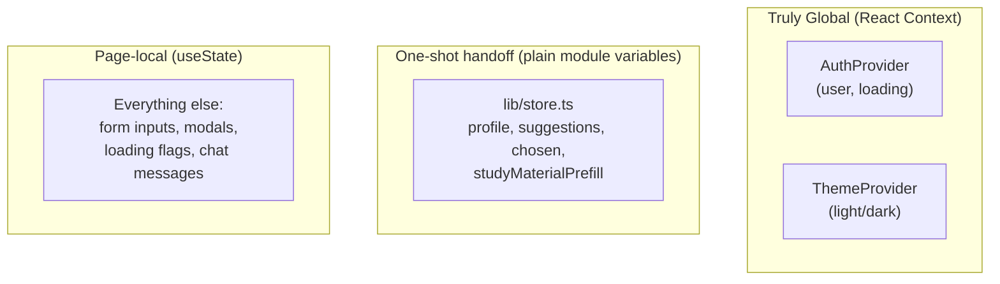
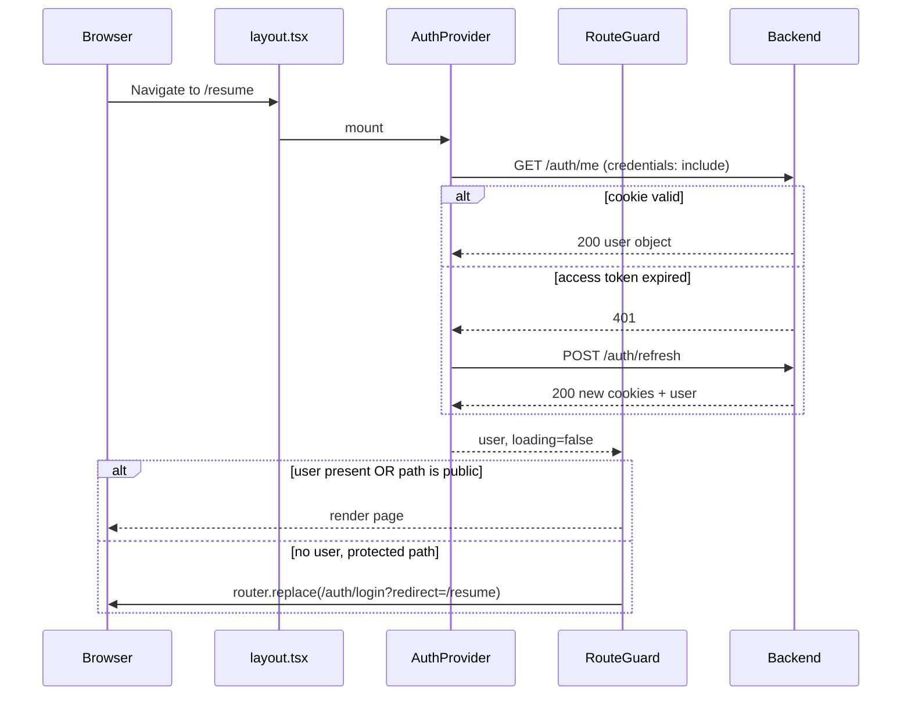

# Part 4 — Frontend Documentation

> Part of the VazhiAI Engineering Knowledge Base. See [docs/README.md](./README.md) for the full table of contents.

## 4.1 File-by-File Reference

### `lib/` — Cross-cutting concerns

| File | Purpose |
|---|---|
| `lib/api.ts` | The single, centralized API client. Every backend call goes through `apiFetch()`, which attaches cookies (`credentials: "include"`), auto-retries once via silent token refresh on a `401`, and redirects to login if refresh also fails. Exposes one typed function per backend endpoint (`apiLogin`, `getActiveRoadmap`, `sendChatMessage`, etc.). |
| `lib/auth.tsx` | React Context (`AuthProvider`/`useAuth`) holding the current user's auth state (`user`, `loading`). On mount, calls `GET /auth/me`; on 401, attempts a silent refresh. Exposes `login()`, `logout()`, `refreshUser()`, `updateUser()`. |
| `lib/theme.tsx` | React Context (`ThemeProvider`/`useTheme`) for light/dark mode, persisted to `localStorage` and reflected via a `data-theme` attribute on `<html>` (consumed by CSS variables in `globals.css`). |
| `lib/store.ts` | A tiny, hand-rolled **in-memory** store (plain module-level variables, not React state) for transient cross-page data: the in-progress onboarding profile, generated suggestions, the chosen suggestion, and a "study material prefill" (topics passed from the roadmap page to the study-material page). Explicitly *not* persisted — cleared on refresh, by design. |
| `lib/constants.ts` | Frontend-side mirror of backend `constants.py`: field options (with icons/descriptions for UI cards), career goals per field, experience levels, domain-specific tool checklists — used to render the onboarding wizard. |
| `lib/demoRoadmap.ts` | Static, hardcoded sample data powering the public `/demo-course` preview — no API calls involved. |
| `lib/utils.ts` | Small pure helper functions: `cn()` (merges Tailwind classes safely via `clsx` + `tailwind-merge`), `getInitials()`, `getDifficultyClass()`. |

### `types/index.ts`
Every shared TypeScript interface — `UserPublic`, `BroadOnboardingRequest`, `CareerSuggestion`, `RoadmapOutlineResponse`, `DayRoadmapDetails`, `StudyMaterialRequest/Response`, etc. — deliberately kept in close correspondence with the backend's Pydantic schemas (`models/schemas.py`), so a change to the API contract has an obvious, matching place to update on the frontend.

### `components/`

| File | Purpose |
|---|---|
| `components/auth/RouteGuard.tsx` | Client-side route protection (see §4.5) — redirects unauthenticated users away from non-public paths, based on `useAuth()`'s resolved state. |
| `components/ThemeToggle.tsx` | A button that calls `useTheme().toggle()`. |

### `app/` — Pages (Next.js App Router; each folder = one URL segment)

| Route | File | Purpose |
|---|---|---|
| `/` | `app/page.tsx` | The main authenticated experience: active roadmap view, day-by-day plan, progress checklist, roadmap customization/regeneration. |
| `/landing` | `app/landing/page.tsx` | Public marketing page (animated counters, scroll effects). |
| `/get-started` | `app/get-started/page.tsx` | Entry point into the suggestions flow. |
| `/auth/login`, `/auth/signup`, `/auth/forgot-password`, `/auth/reset-password` | `app/auth/*/page.tsx` | Authentication forms. |
| `/onboarding` | `app/onboarding/page.tsx` | Multi-step profile wizard. |
| `/suggestions` | `app/suggestions/page.tsx` | AI career suggestions + the Explore Paths conversational roadmap editor. |
| `/home`, `/dashboard` | `app/home/page.tsx`, `app/dashboard/page.tsx` | Progress/overview dashboards. |
| `/resume` | `app/resume/page.tsx` | Resume builder, AI optimization, client-side PDF export. |
| `/study-material` | `app/study-material/page.tsx` | Study material generation + history. |
| `/quiz/[day]` | `app/quiz/[day]/page.tsx` | Dynamic route — per-day timed MCQ quiz (`[day]` is a Next.js dynamic route segment, available via `useParams()`). |
| `/demo-course` | `app/demo-course/page.tsx` | Public, unauthenticated, fully static preview — explicitly makes no API calls. |
| `/mentors` | `app/mentors/page.tsx` | Mentor network UI shell (feature in progress — see Part 1). |
| `app/layout.tsx` | Root layout wrapping every page in `ThemeProvider → AuthProvider → RouteGuard`. |

## 4.2 Architecture: Next.js App Router

**Simple explanation**: The App Router turns your folder structure directly into your website's URL structure. A folder `app/resume/` with a `page.tsx` inside becomes the `/resume` page. No separate routing configuration file to maintain.

**Technical explanation**: This project uses Next.js 14's **App Router** (not the older Pages Router). Every route file starts with `"use client"`, meaning these are **Client Components** — rendered in the browser, with full access to hooks (`useState`, `useEffect`), browser APIs, and event handlers. This is a deliberate choice: this app is fundamentally an interactive, authenticated dashboard experience (closer to a traditional SPA) rather than a content-heavy, SEO-critical site that would benefit most from React Server Components' server-side rendering.

**Why Next.js at all, then, instead of plain Create React App / Vite + React Router?** Next.js still provides: file-based routing (less boilerplate), built-in `next.config.js` rewrites (used here to proxy `/api/*` to the backend, making requests appear same-origin from the browser's perspective for cleaner cookie handling on some paths), automatic code-splitting per route, and a mature production build/optimization pipeline — valuable infrastructure even when a given page happens to be a Client Component.

**Advantages of file-based routing**: navigable structure (the URL tells you exactly which file to open), automatic code-splitting per route (visiting `/resume` doesn't download the `/quiz` page's JS).
**Disadvantages**: less explicit than a central route config file — harder to see "all routes and their guards" in one place (this project compensates with the `PUBLIC_PATHS` allowlist in `RouteGuard.tsx`, a single source of truth for "who can see this without logging in").
**Alternatives**: React Router (manual route config, more control, no framework-level SSR/optimization), Remix (similar file-based approach with a stronger server-first philosophy).

## 4.3 State Management

**No Redux, Zustand, or similar global state library is used.** State is handled with three different, deliberately-scoped tools, each suited to a different kind of data:

1. **React Context** for genuinely global, cross-page concerns: `AuthProvider` (who is logged in) and `ThemeProvider` (light/dark mode). Both wrap the entire app once in `layout.tsx`.
2. **Component-local `useState`** for anything scoped to a single page/component — form inputs, loading flags, modal open/closed state. This is the vast majority of state in the app.
3. **`lib/store.ts`**, a hand-rolled, non-reactive, module-level variable store for a small amount of *transient, one-time-use* data passed between pages without a round-trip to the backend or a URL parameter — e.g., "the user just picked this suggestion, carry it to the next page" or "prefill the study-material form with these topics from the roadmap page."

**Why not Redux/Zustand?** The app's cross-page state needs are narrow (auth identity, theme, and a handful of one-shot handoffs) — introducing a full state-management library would add boilerplate and a learning-curve cost not justified by the actual complexity here. Context is the right-sized tool for "a few pieces of truly global state," which is exactly what this app has.

**Why is `lib/store.ts` *not* React state (no `useState`/Context)?** Because it deliberately does **not** need to be reactive — it's a one-time handoff ("read once and forget," as its own `consumeStudyMaterialPrefill()` comment says), not a live value multiple components need to re-render in response to. Using plain module-level variables here is a conscious minimalism choice, not an oversight — introducing Context for a write-once/read-once value would be over-engineering.

**Common mistake this avoids**: reaching for global state (Redux/Context) by default for *everything*, including state that's genuinely local to one component — a very common over-engineering mistake in React codebases. This project's restraint (plain `useState` almost everywhere) is worth calling out positively in an interview.

## 4.4 Hooks & Custom Hooks

The project relies on React's built-in hooks throughout (`useState`, `useEffect`, `useRef`, `useContext` via `useAuth()`/`useTheme()`) plus Next.js's own (`useRouter`, `usePathname`, `useParams`) and Framer Motion's (`useScroll`, `useTransform` in the landing page's scroll-driven animations).

**Custom hooks present**: `useAuth()` and `useTheme()` (thin wrappers around `useContext`), and a small local `useCounter()` hook inside `landing/page.tsx` (an animated number counter using `requestAnimationFrame` with an eased progress curve) — a good example of extracting a self-contained, reusable piece of animation logic into its own hook rather than inlining it.

**What's notably absent**: no broader library of shared custom hooks (e.g., a generic `useApi()`/`useFetch()` wrapper for loading/error state, or a `useDebounce()`). Several pages repeat similar `useState` triples for loading/error/data — a good candidate for extraction as the codebase grows (see Part 9).

## 4.5 Authentication Flow & Protected Routes (Frontend Side)

This is one of the most instructive parts of the codebase — a real architectural lesson is documented directly in the code comments.

**The problem that was hit**: Next.js Edge Middleware (`middleware.ts`) originally tried to check for the auth cookie before allowing navigation to a protected page — the standard, textbook approach for route protection in Next.js. It never worked, because:

> The `access_token`/`refresh_token` cookies are set by the FastAPI backend (on its own domain), not by this Next.js app. Cookies are scoped per-domain — this Vercel edge middleware could never see them.

**The fix**: `middleware.ts` is now an intentional no-op (`return NextResponse.next()`), and auth is enforced entirely client-side:

1. `AuthProvider` (`lib/auth.tsx`), on mount, does a direct cross-origin `fetch("/auth/me", { credentials: "include" })` straight to the backend. Because this is a real HTTP request *to the backend's own domain*, the browser correctly attaches the backend's cookie (unlike the edge middleware, which never talks to the backend at all — it just inspects the incoming request to the *frontend*).
2. If that returns `401`, it attempts a silent refresh (`POST /auth/refresh`) before giving up.
3. `RouteGuard.tsx` (wrapping every page via `layout.tsx`) reads `{ user, loading }` from `useAuth()`. While `loading`, it renders nothing (avoiding a flash of protected content). Once resolved: if the current path isn't in a `PUBLIC_PATHS` allowlist and there's no `user`, it redirects to `/auth/login?redirect=<original path>`.

**Why client-side gating instead of middleware, given the choice?** It wasn't really a stylistic choice — it's a hard technical constraint of the cross-domain cookie setup. This is worth stating plainly in an interview: **middleware-based route protection only works when the middleware runs on the same domain that receives the auth cookie.** In a same-domain deployment (e.g., using Next.js API routes as the backend, or a reverse proxy unifying both domains), the original middleware approach would have worked.

**Trade-off of the current approach**: a brief flash-of-loading (`RouteGuard` returns `null` while `loading`) instead of an instant server-side redirect before any JS downloads — an acceptable UX cost for correctness here, and one that's actively minimized (no flash of *unauthorized content*, just a blank moment).

## 4.6 Forms & Validation

Forms (login, signup, onboarding wizard) use plain controlled `useState` inputs with manual validation logic in the submit handler, rather than a form library (React Hook Form, Formik) or a schema-validation library (Zod) on the frontend. Server-side validation (Pydantic, on the backend) is the actual source of truth for correctness — the frontend's checks are a UX convenience (immediate feedback) rather than the security boundary.

**Trade-off**: this is fine for the current form complexity (a handful of fields per step), but a multi-step wizard with conditional fields (like `onboarding/page.tsx`'s 5-step flow) is exactly the kind of form complexity where a dedicated form library starts paying for itself — less manual `useState` wiring, built-in per-field error display, easier conditional validation.

## 4.7 Styling: Tailwind + CSS Variables

Tailwind CSS provides utility classes for layout/spacing/typography, while visual **theme values** (colors, specifically) are defined as CSS custom properties (`var(--text)`, `var(--accent)`, `var(--surface)`, etc.) in `globals.css`, swapped based on the `data-theme` attribute `ThemeProvider` sets on `<html>`. This is a clean hybrid: Tailwind for rapid, consistent utility-based layout, CSS variables for the small set of values that need to change at runtime (theme colors) — Tailwind's own dark-mode utilities would require a class toggle on every element or a `dark:` variant on every color usage, which is more verbose than swapping a handful of CSS variables once at the root.

**`cn()` helper** (`clsx` + `tailwind-merge`): resolves the classic Tailwind conflict problem — if you conditionally combine `"p-4"` and (in some branch) `"p-2"`, plain string concatenation would leave both classes present with unpredictable CSS specificity/order outcomes; `tailwind-merge` intelligently keeps only the last conflicting utility.

## 4.8 Performance: Code Splitting, Lazy Loading, Memoization

- **Code splitting**: automatic, per-route, via Next.js's App Router — visiting `/resume` doesn't download `/quiz`'s JavaScript bundle.
- **Lazy loading / `React.lazy` / `Suspense`**: **not explicitly used** — no component in the codebase is wrapped in `React.lazy()` or `<Suspense>` boundaries beyond what Next.js does automatically per-route. Heavy client-only libraries (`html2canvas`, `jspdf` in the resume page) are imported directly at the top of the file rather than dynamically imported — meaning their code ships as part of the `/resume` route's bundle even before the user clicks "export PDF." A `next/dynamic` import for these would be a straightforward, high-value optimization (see Part 9).
- **Memoization (`useMemo`/`useCallback`/`React.memo`)**: not heavily used across the codebase — most components are small/medium and re-render cheaply enough that memoization hasn't been necessary yet. This is a defensible "don't optimize prematurely" stance, but worth knowing where it would matter first: the chat message list (re-rendering the whole conversation on every new token/message) and the roadmap day list (potentially many days) are the most likely future hot spots.
- **Animation performance**: Framer Motion is used extensively (`motion.div`, `AnimatePresence`) for transitions; Framer Motion animates via transforms/opacity where possible, which are GPU-accelerated and cheap, rather than animating layout-triggering properties.

## 4.9 Error Boundaries & Suspense

**Not used.** There are no React Error Boundary components in the codebase — an uncaught render-time exception in any component would currently crash that part of the React tree with Next.js's default error overlay (in dev) or a blank/broken page (in production), rather than a graceful, contained fallback UI. Next.js does support an `error.tsx` convention per route segment for exactly this purpose; adding one (even a single top-level `app/error.tsx`) would be a cheap, high-value production-readiness improvement (see Part 9).

## 4.10 Rendering Flow / React Lifecycle (One Page, Walked Through)

Using `app/study-material/page.tsx` as a concrete example:

1. **Mount**: component function runs once, `useState` initializes (`loading = true`, empty history array).
2. **Effect fires** (`useEffect(..., [])`): calls `getStudyMaterialHistory()` from `lib/api.ts`.
3. That calls `apiFetch("/study-material/history")`, which attaches cookies and awaits the response.
4. On success: `setHistory(data)`, `setLoading(false)` — triggers a re-render showing the fetched list.
5. On a `401` mid-flight: `apiFetch` transparently attempts `POST /auth/refresh`; if that succeeds, the *original* request is retried automatically and the caller (`getStudyMaterialHistory`) never even sees the interruption; if refresh fails, the user is redirected to `/auth/login`.
6. User interacts (clicks "Generate") → local `useState` updates (form fields) → on submit, another `apiFetch` call → loading state → success/error state → re-render.

This "fetch in `useEffect`, track loading/error in local state" pattern repeats across nearly every page — a clear, consistent convention, though also a candidate for a shared custom hook (`useApi()`) to reduce repetition (see Part 9).

## 4.11 Build Process & Environment Variables

- `npm run dev` — local dev server with hot reload.
- `npm run build` — production build (`next build`), type-checks, and bundles.
- `npm run start` — serves the production build.
- `NEXT_PUBLIC_API_URL` is the only frontend env variable — the `NEXT_PUBLIC_` prefix is a Next.js convention meaning "this value is intentionally inlined into the client-side JS bundle and visible to anyone" — correct here since it's just a base URL, not a secret. Any *actual* secret must never use this prefix.
- `next.config.js` rewrites `/api/*` requests to `${NEXT_PUBLIC_API_URL}/:path*` — this was fixed during the review to include a `localhost:8000` fallback, since an unset env var previously resolved to the literal string `"undefined/:path*"`, silently breaking every API call.

## 4.12 Interview Questions — Part 4

- *Q: Why does this app use React Context instead of Redux?* — Its cross-page state needs are narrow: auth identity and theme. Context is the right-sized tool for a small number of truly global values; Redux's boilerplate (actions, reducers, store setup) isn't justified by this app's actual state complexity.
- *Q: Explain the middleware-vs-client-side-auth decision like you would to a client.* — "We initially tried to check 'is this user logged in' at the very edge, before the page even loads, which is normally the fastest approach. But our login cookie is issued by a different address than our website's address, and browsers don't share cookies across different addresses for security reasons. So we moved that check to happen right as the page loads instead, by asking our own server directly — which does receive the cookie correctly."
- *Q: Where would you add `React.lazy`/dynamic imports first, and why?* — The resume page's `html2canvas`/`jspdf` imports — both are sizable libraries only needed when a user clicks "export PDF," not on initial page load, so shipping them eagerly wastes bytes for every visitor who never exports.
- *Q: What's the biggest frontend production-readiness gap?* — No error boundaries — an uncaught exception anywhere currently has no graceful fallback UI, which is a real risk for a user-facing production app.

## 4.13 Key Takeaways — Part 4

- Next.js 14 App Router, entirely Client Components (`"use client"`) — an interactive-dashboard-first choice, not a content/SEO-first one.
- State management is deliberately minimal and scoped: Context for truly global values (auth, theme), local `useState` for everything else, and a small non-reactive module store for one-shot page-to-page handoffs — a good example of not over-engineering.
- The auth/route-protection story is a genuinely instructive real-world lesson about cross-domain cookie scoping breaking the "textbook" Next.js middleware pattern, solved correctly via client-side gating.
- Biggest, cheapest production-readiness wins available: error boundaries, dynamic imports for heavy PDF-export libraries, and extracting the repeated fetch/loading/error pattern into a shared hook.
