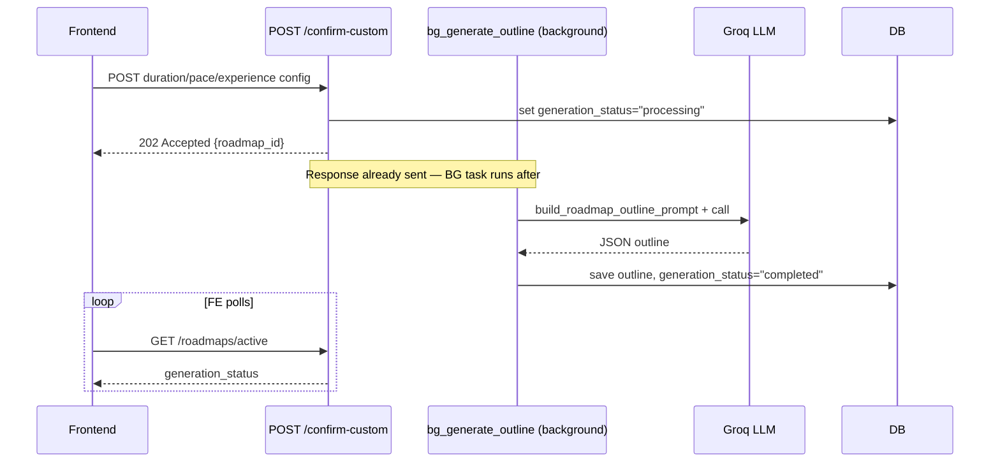

# Part 5 — API Reference

> Part of the VazhiAI Engineering Knowledge Base. See [docs/README.md](./README.md) for the full table of contents.
>
> Conventions used below: 🔓 = no authentication required. 🔒 = requires a valid session (cookie or Bearer token). ⏱ = rate-limited (limit shown). All authenticated endpoints resolve the user via the `get_current_user` dependency described in [Part 2, §2.5](./01-backend.md#25-authentication--authorization). All request/response bodies are JSON unless noted.

## 5.1 Auth — `routes/auth.py` (prefix `/auth`)

### `POST /auth/signup` 🔓 ⏱ 5/hour
- **Request**: `{ email, password, name, educational_status?, field?, profession? }` (`SignupRequest`)
- **Validation**: `password` min 8 characters (`@field_validator`).
- **Business logic**: checks email uniqueness → hashes password (bcrypt) → creates `User` row → issues access + refresh tokens.
- **Response**: `200` — `{ access_token, token_type: "bearer", user: UserPublic }`, plus `Set-Cookie: access_token`, `Set-Cookie: refresh_token` (both `HttpOnly`).
- **Errors**: `400` if email already registered.

### `POST /auth/login` 🔓 ⏱ 10/minute
- **Request**: `{ email, password }` (`LoginRequest`)
- **Business logic**: looks up user by (lowercased) email → `verify_password` (bcrypt compare) → checks `is_active` → issues token pair.
- **Response**: same shape as signup.
- **Errors**: `401` invalid credentials, `403` account disabled.

### `POST /auth/refresh` 🔓 ⏱ 30/minute
- **Request**: none (reads `refresh_token` cookie).
- **Business logic**: `rotate_refresh_token()` — validates hash against `refresh_tokens`, checks not expired/revoked, **revokes the old token**, issues a new pair.
- **Response**: same shape as login; new cookies replace the old ones.
- **Errors**: `401` if no cookie present or token invalid/expired/revoked.

### `POST /auth/logout` 🔒 ⏱ 10/minute
- **Business logic**: `revoke_all_user_tokens()` — marks every active refresh token for the user as revoked; clears both cookies.
- **Response**: `200` `{ message: "Logged out successfully." }`

### `GET /auth/me` 🔒
- **Response**: `200` `UserPublic` (id, email, name, full profile fields, `has_profile` boolean).
- **Errors**: `401` not authenticated / invalid token.

### `PUT /auth/profile` 🔒
- **Request**: `ProfileUpdateRequest` — any subset of profile fields (all optional; only non-`None` fields are applied via `body.model_dump(exclude_none=True)`).
- **Response**: `200` updated `UserPublic`.

## 5.2 Account Recovery — `routes/recovery.py` (prefix `/auth`)

### `POST /auth/forgot-password` 🔓 ⏱ 3/15 minutes
- **Request**: `{ email }`
- **Business logic**: if the user doesn't exist, performs a **dummy bcrypt hash** (timing equalization) and still returns success — this is deliberate anti-enumeration design, not a bug. If found: invalidates prior OTPs, generates a new 8-digit OTP (`secrets.randbelow`, cryptographically secure), stores it, dispatches the email in a background thread.
- **Response**: always `200` `{ message: "If this email is registered, a secure OTP has been sent." }` — identical regardless of whether the email exists.

### `POST /auth/verify-otp` 🔓 ⏱ 5/10 minutes
- **Request**: `{ email, otp }`
- **Business logic**: finds the most recent active OTP for the user; enforces a 5-attempt brute-force lockout (`attempts_count`); on success, stamps `verified_at` (does not consume the OTP yet — `reset-password` needs it).
- **Response**: `200` `{ message: "OTP verified successfully..." }`
- **Errors**: `400` invalid/expired/wrong OTP, `429` after 5 failed attempts (OTP permanently voided).

### `POST /auth/reset-password` 🔓 ⏱ 5/10 minutes
- **Request**: `{ email, otp, new_password }` — `new_password` validated (min 8 chars + at least one digit).
- **Business logic**: requires the OTP to have been verified within the last 5 minutes (`VERIFY_WINDOW_MINUTES`) and not yet used; hashes and saves the new password; marks the OTP used.
- **Response**: `200` `{ message: "Password reset successfully..." }`
- **Errors**: `400` invalid OTP / verification window expired.

## 5.3 Onboarding — `routes/onboarding.py` (prefix `/onboarding`)

### `POST /onboarding/complete` 🔒
- **Request**: `BroadOnboardingRequest` — educational status, field, dream job, experience level, plus student- or professional-specific fields, plus profile-extension lists (known tools, target skills, interests, certifications).
- **Business logic**: updates core `User` fields; conditionally updates student- or professional-specific columns based on `educational_status`; upserts the `UserProfile` extension row.
- **Response**: `200` `UserPublic` (now with `has_profile: true`).

### `GET /onboarding/profile` 🔒
- **Response**: `200` `UserProfileResponse`.
- **Errors**: `404` if onboarding hasn't been completed yet.

## 5.4 Suggestions — `routes/suggestions.py`

### `POST /generate-suggestions` 🔒 ⏱ 10/minute
- **Request**: `StudentProfile` (legacy-shaped profile; merged server-side with the stored user profile for maximum context).
- **Business logic**: builds an enriched profile dict (stored data takes priority over request-body data) → `generate_suggestions_from_dict()` → LLM call via `groq_service` → validated against `SuggestionsResponse`.
- **Response**: `200` `{ suggestions: [CareerSuggestion, ...] }` (3–4 items).
- **Errors**: `500` generic message on LLM/validation failure (internal details logged, not leaked).

## 5.5 Chat — `routes/chat.py` (prefix `/chat`)

### `POST /chat/refine-suggestions` 🔒 ⏱ 10/minute
- **Request**: `{ profile: StudentProfile, history: ChatMessageInput[], message }` (message capped at 4000 chars).
- **Business logic**: builds a one-off system prompt inline (not via `prompt_engine.py`), calls the LLM directly, robustly extracts JSON from the reply (handling markdown-fenced or loosely-formatted output), falls back to returning raw text as `reply` if JSON parsing fails entirely (graceful degradation instead of a hard error).
- **Response**: `200` `{ reply, suggestions: CareerSuggestion[] | null }`.

### `GET /chat/history` 🔒
- **Query params**: `session_id?`, `limit` (default 200, clamped 1–200).
- **Business logic**: fetches the most recent `limit` messages (ordered by `created_at` descending), then reverses to ascending order for display — this "fetch newest-first, then reverse" pattern guarantees you get the *most recent* window when capping, not an arbitrary old slice.
- **Response**: `200` `ChatMessageResponse[]`.

### `POST /chat/message` 🔒 ⏱ 20/minute
- **Request**: `{ message (max 4000 chars), session_id?, day_number? }`
- **Business logic**: loads the active roadmap + (if `day_number` given) that day's generated content for context; loads the last 10 messages as conversation history; saves the user's message immediately; calls `generate_chat_response()`; saves and returns the assistant's reply.
- **Response**: `200` `ChatMessageResponse` (the assistant's message row).
- **Errors**: `500` generic message on LLM failure (rolls back the DB write of the user message's session state on error, logs full details server-side).

### `POST /chat/explore-paths` 🔒 ⏱ 15/minute
- **Request**: `ExplorePathsRequest` — `{ message (max 4000 chars), history, confirm_new_roadmap }`
- **Business logic**: the most complex chat endpoint — see [Part 6](./05-auth-and-request-lifecycle.md) for the full flow. Classifies user intent (`minor_modification` / `major_restructuring` / `new_roadmap` / `new_roadmap_confirmed` / `clarification` / `general_chat`), applies roadmap-outline edits with smart day-content cache invalidation (only regenerating days that actually changed), or creates a brand-new roadmap after explicit user confirmation.
- **Response**: `200` `{ reply, intent, roadmap_updated, needs_confirmation, updated_roadmap }`.

## 5.6 Roadmaps — `routes/roadmaps.py` (prefix `/roadmaps`)

### `POST /roadmaps` 🔒
- **Request**: `RoadmapCreate` — `{ title, description?, why_this_fits_user?, required_skills?, roadmap_steps?, estimated_timeline?, difficulty? }`
- **Business logic**: deactivates the user's previous active roadmap(s), creates a new active one, stamping the user's current field/status/dream-job as roadmap-time context (used later for AI prompt personalization even if the user's profile changes afterward).
- **Response**: `201`/`200` `RoadmapResponse`.

### `GET /roadmaps` 🔒 — all roadmaps for the user.
### `GET /roadmaps/active` 🔒 — the current active roadmap, `404` if none.
### `POST /roadmaps/active/confirm` 🔒 — marks the active roadmap `is_confirmed = true`.

### `POST /roadmaps/progress` 🔒
- **Request**: `DailyProgressCreate` — `{ date, roadmap_id?, day_number?, completed_tasks?, solved_problems?, notes? }`
- **Business logic**: **ownership check added during security review** — if `roadmap_id` is supplied, verifies it belongs to the current user *before* trusting it as a foreign key; upserts by `(user_id, date)`.
- **Response**: `200` `DailyProgressResponse`.
- **Errors**: `404` if the supplied `roadmap_id` doesn't belong to the current user.

### `GET /roadmaps/progress` 🔒 — last 30 entries, ordered by date descending.

### `POST /roadmaps/active/confirm-custom` 🔒 ⏱ 5/minute
- **Request**: `DetailedRoadmapConfig` — `{ duration_weeks, experience_level, available_time, learning_pace }`
- **Business logic**: sets `generation_status = "processing"`, schedules `bg_generate_outline()` as a `BackgroundTask`, returns immediately.
- **Response**: `202 Accepted` `{ message, roadmap_id, generation_status: "processing" }` — **not** a full `RoadmapOutlineResponse` (a mismatch found and fixed on the frontend during review; see `RoadmapGenerationStartedResponse` in `lib/api.ts`).



### `GET /roadmaps/active/day/{day_number}` 🔒 ⏱ 20/minute
- **Business logic**: if the day's detailed content already exists, returns it immediately. If already `"processing"`, returns `202`. Otherwise, takes a **row lock** (`.with_for_update()`) on the roadmap, marks the day `"processing"`, schedules `bg_generate_day()`, returns `202`. The row lock is the fix for a previously-identified race condition (two simultaneous requests both seeing "not processing" and double-scheduling generation).
- **Response**: `200` `DayRoadmapDetails` (if ready) or `202` `{ status: "processing", day }`.
- **Errors**: `404` no confirmed active roadmap, or day not found in outline.

### `POST /roadmaps/active/progress` 🔒 / `GET /roadmaps/active/progress` 🔒
Same as `/roadmaps/progress` but explicitly scoped to (and deriving `roadmap_id` from) the current active roadmap — the safer sibling endpoint that doesn't trust a client-supplied `roadmap_id` at all.

### `POST /roadmaps/active/tests` 🔒 (query param `day_number`)
- **Request**: `TestSubmitRequest` — `{ answers: string[] }`
- **Business logic**: grades against the stored MCQ answer key for that day, computes a score out of 10, upserts a `DailyTest` row.
- **Response**: `200` `TestScoreResponse` — score, totals, per-question correct/selected breakdown.
- **Errors**: `400` if answer count doesn't match question count, `404` if day details not yet generated.

### `GET /roadmaps/active/tests` 🔒 — all test results for the active roadmap.

## 5.7 Resume — `routes/resume.py` (prefix `/resume`)

### `POST /resume/optimize` 🔒 ⏱ 10/hour
- **Request**: `{ resume_data: Dict[str, Any] (max 20,000 chars serialized), target_role (max 200 chars) }`
- **Business logic**: sends the raw resume JSON + target role to the LLM via `build_resume_optimization_prompt`, requesting rewritten summary/experience/project bullet points and cleaned skills, all in the same JSON shape as the input.
- **Response**: `200` — optimized resume JSON (`summary`, `education[]`, `experience[]`, `projects[]`, `skills[]`).
- **Errors**: `500` generic message on failure.

## 5.8 Study Material — `routes/study_material.py` (prefix `/study-material`)

### `POST /study-material/generate` 🔒 ⏱ 5/hour
- **Request**: `StudyMaterialRequest` — `{ topics: string[] (1–5 items, 2–200 chars each), education_level?, difficulty, language?, output_length }`
- **Business logic**: calls the LLM for pure Markdown output (13 fixed sections — see `prompt_engine.build_study_material_prompt`); persists the result.
- **Response**: `201 Created` `StudyMaterialResponse` (includes full `markdown_content`).
- **Errors**: `422` on validation failure (bad topic count/length/difficulty/output_length), `502` if the LLM call fails or returns unusable output.

### `GET /study-material/history` 🔒 — last 50, without content body (`StudyMaterialListItem[]`).
### `GET /study-material/{material_id}` 🔒 — full content, ownership-checked (`user_id` filter), `404` if not found/not owned.
### `DELETE /study-material/{material_id}` 🔒 — `204 No Content`, ownership-checked.

## 5.9 Example Request/Response

**Request** — `POST /auth/login`
```json
{ "email": "jane@example.com", "password": "hunter22" }
```

**Response** — `200 OK`
```json
{
  "access_token": "eyJhbGciOiJIUzI1NiIs...",
  "token_type": "bearer",
  "user": {
    "id": "3f9a2b7e-...",
    "email": "jane@example.com",
    "name": "Jane",
    "educational_status": "Student",
    "field": "Computer Science / IT",
    "has_profile": true
  }
}
```
Response headers additionally include:
```
Set-Cookie: access_token=...; HttpOnly; Secure; SameSite=None; Path=/; Max-Age=1800
Set-Cookie: refresh_token=...; HttpOnly; Secure; SameSite=None; Path=/auth/refresh; Max-Age=2592000
```

## 5.10 Interview Questions — Part 5

- *Q: Why does `confirm-custom-roadmap` return 202 instead of 200 with the finished roadmap?* — Because outline generation is an LLM call that can take many seconds; blocking the HTTP response until it finishes would time out or feel unresponsive. `202 Accepted` is the correct REST status for "request accepted, processing asynchronously" — the client is expected to poll `GET /roadmaps/active` for completion.
- *Q: Why does `/auth/forgot-password` always return the same message?* — To prevent user enumeration — if the response differed based on whether the email existed, an attacker could use it to discover which emails are registered users.
- *Q: Walk me through what makes `/roadmaps/progress` different from `/roadmaps/active/progress`.* — The former accepts a client-supplied `roadmap_id` (now ownership-checked after a security fix); the latter derives the roadmap entirely server-side from the user's current active roadmap, never trusting a client-supplied ID at all — a stricter, safer variant of the same operation.

## 5.11 Key Takeaways — Part 5

- Every endpoint that returns or mutates user-owned data filters by `current_user.id`, with one historical exception (fixed) around a client-supplied `roadmap_id`.
- Rate limits are present on every authentication-sensitive and every LLM-backed endpoint.
- `202 Accepted` + client polling is used consistently for the two genuinely slow operations (roadmap outline generation, per-day content generation).
- Response shapes are explicit Pydantic schemas, never raw ORM objects — see Part 2, §2.6.
