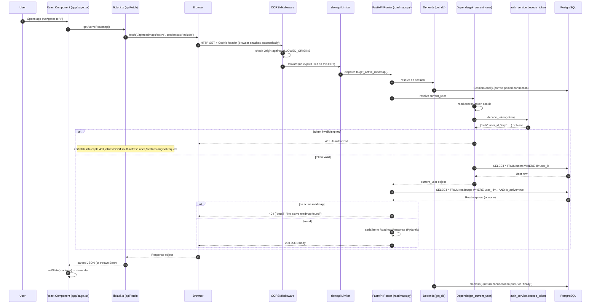

# Parts 6 & 7 — Authentication Flow and End-to-End Request Lifecycle

> Part of the VazhiAI Engineering Knowledge Base. See [docs/README.md](./README.md) for the full table of contents.

## Part 6 — Authentication Flow, Step by Step

### 6.1 Registration (Signup)

1. User submits the signup form (`app/auth/signup/page.tsx`) → `apiSignup()` → `POST /auth/signup`.
2. FastAPI parses the body into `SignupRequest`, running the `password_strength` validator (min 8 characters) **before** the route function body ever executes. A failing validator short-circuits with `422 Unprocessable Entity` automatically.
3. `routes/auth.py::signup()` checks for an existing user with that (lowercased) email; if found, `400 Email already registered`.
4. `hash_password()` (bcrypt, `auth_service.py`) hashes the plaintext password — the plaintext is never persisted or logged.
5. A `db_models.User` row is created, committed, and refreshed (to get the DB-generated `id`/`created_at`).
6. `create_access_token({"sub": user.id})` mints a JWT; `create_refresh_token(user.id, db, request)` generates a random 64-byte token, stores its SHA-256 hash in `refresh_tokens`, and returns the raw value.
7. `_build_auth_response()` builds the `TokenResponse` JSON body and calls `set_auth_cookies()`, attaching both tokens as `HttpOnly` cookies on the response.
8. Frontend receives `{ user, access_token }`, calls `login(user)` (storing it in `AuthProvider`'s React state), and routes to `/onboarding` (since a brand-new user has `has_profile: false`).

### 6.2 Login

Nearly identical to signup, minus account creation: look up by email → `verify_password()` (bcrypt compare against the stored hash) → check `is_active` → issue the same token pair → same cookie-setting response. Frontend routes to `/home` if `has_profile` is already `true`, or `/onboarding` if not.

### 6.3 JWT Generation (Detail)

```python
def create_access_token(data: dict, expires_delta=None) -> str:
    to_encode = data.copy()                      # {"sub": user.id}
    expire = datetime.now(timezone.utc) + (expires_delta or timedelta(minutes=30))
    to_encode.update({"exp": expire})
    return jwt.encode(to_encode, SECRET_KEY, algorithm="HS256")
```
The payload deliberately carries **only** the user's ID (`sub`, the JWT-standard "subject" claim) plus an expiry (`exp`) — no email, name, or role is embedded. This is a good practice: the token is a proof of identity, not a cache of user data; every request that needs more than the ID re-fetches the current `User` row from the database (`get_current_user` does exactly this), guaranteeing the app always acts on fresh data (e.g., if an account were deactivated mid-session, the very next request would see `is_active=False` and reject it — this wouldn't be true if the token itself carried a cached "is_active" flag).

### 6.4 Token Validation (Every Protected Request)

`get_current_user()` (a FastAPI dependency, resolved automatically wherever a route declares it):
1. Prefer the `access_token` **cookie**; fall back to an `Authorization: Bearer <token>` header (kept for backward compatibility / non-browser clients like API testing tools).
2. If neither is present → `401 Not authenticated`.
3. `decode_token()` — `jwt.decode(token, SECRET_KEY, algorithms=["HS256"])`, catching `JWTError` (covers expired, malformed, or badly-signed tokens) → `401 Invalid or expired token`.
4. Extract `sub` (the user ID) from the decoded payload.
5. Look up the `User` row by ID; if missing or `is_active=False` → `401 User not found or inactive`.
6. Return the `User` object — now available as `current_user` in the route function.

### 6.5 Refresh

Covered in depth in [Part 2, §2.5.3](./01-backend.md#253-refresh-tokens--rotation). Summary: `POST /auth/refresh` reads the `refresh_token` cookie (scoped via `path=/auth/refresh`, so it's only ever sent on this one endpoint — a nice defense-in-depth detail limiting the cookie's blast radius), validates + immediately revokes it, and issues a fresh pair. The frontend's `apiFetch()` wrapper calls this **automatically and transparently** whenever any request returns `401`, retrying the original request once with the new cookies — the end user never manually "refreshes" anything.

### 6.6 Logout

`POST /auth/logout` calls `revoke_all_user_tokens()`, which does a bulk `UPDATE refresh_tokens SET is_revoked=True WHERE user_id=... AND is_revoked=False` — revoking **every** active session for that user in one query, not just the current device's token. This is a deliberate "log out everywhere" semantic. Cookies are cleared on the response (`delete_cookie`, matching path/samesite attributes exactly — cookie deletion must match the original cookie's scoping attributes or the browser won't remove it).

### 6.7 Authorization — Ownership-Based, Not Role-Based

**Important, honest distinction for interviews**: this project implements **authorization**, but not **Role-Based Access Control (RBAC)**. There is no `role` column on `User`, no admin/staff/superuser concept, no permission table. Every authorization check in this codebase is the same shape: *"does this row's `user_id` equal `current_user.id`?"* — this is sometimes called **ownership-based** or **resource-based** authorization, and it's the correct, sufficient model for an app where every resource (a roadmap, a chat message, a study material) belongs to exactly one user and no user ever needs to see another's data.

**What RBAC is, for comparison** (useful to know even though it's not used here): RBAC assigns each user one or more roles (e.g., `admin`, `editor`, `viewer`), and each role carries a set of permissions (e.g., `can_delete_any_user`, `can_view_all_roadmaps`). A request is authorized if the user's role(s) include the required permission for that action — independent of who *owns* the resource. **This project would need RBAC the moment it introduces any feature where one user legitimately needs to act on another user's data** — the clearest example being the planned "Mentors" feature (Part 1): a mentor plausibly needs to view a *mentee's* roadmap/progress, which is a cross-user access pattern that pure ownership-checking (`user_id == current_user.id`) cannot express. That would require a proper permission model (e.g., a `mentor_assignments` table plus a check like "is `current_user` an assigned mentor for this roadmap's owner").

## Part 7 — End-to-End Request Flow (Fully Detailed)

We trace **one concrete request** — a logged-in user opening the app and it loading their active roadmap (`GET /roadmaps/active`) — through every layer, client to database and back.



### Step-by-step narrative

1. **Client → Router (React)**: `app/page.tsx` calls `getActiveRoadmap()` from `lib/api.ts` inside a `useEffect`.
2. **API Client**: `apiFetch()` builds the request with `credentials: "include"` (so the browser attaches the `access_token` cookie automatically) and a `Content-Type: application/json` header.
3. **Browser → Network**: the browser sends the actual HTTP request, attaching the cookie because the target origin matches the cookie's domain.
4. **Middleware (CORS)**: FastAPI's `CORSMiddleware` checks the request's `Origin` header against `ALLOWED_ORIGINS`; if it doesn't match, the browser (not the server) will block the frontend JS from reading the response — CORS is enforced by the *browser*, with the server's headers just telling it what to allow.
5. **Middleware (Rate Limiter)**: `slowapi` checks this route's configured limit (this particular `GET` has none applied, unlike the mutating/LLM-backed endpoints); if over quota, a `429` is returned before the route function ever runs.
6. **Routing**: FastAPI matches `GET /roadmaps/active` to `get_active_roadmap()` in `routes/roadmaps.py`.
7. **Dependency Injection**: FastAPI resolves `db: Session = Depends(get_db)` and `current_user: User = Depends(get_current_user)` — note `get_current_user` itself depends on `get_db`, so FastAPI resolves the dependency graph, not just a flat list.
8. **Authentication**: `get_current_user` extracts and decodes the JWT, then queries the `User` table by the token's `sub` claim.
9. **Controller (route function)**: with `current_user` resolved, the handler runs its one line of actual logic — query the `roadmaps` table filtered by `user_id` and `is_active`.
10. **Database**: SQLAlchemy issues a parameterized `SELECT`, using the indexed `user_id` column, over the connection borrowed from the pool.
11. **Response shaping**: the ORM row is converted into a `RoadmapResponse` Pydantic model (`response_model=RoadmapResponse` on the route decorator), which also acts as an **output filter** — only fields declared on `RoadmapResponse` are serialized, even if the ORM object has more attributes.
12. **Response → Browser → Frontend**: the JSON body flows back; `apiFetch()` returns the parsed `Response`; the calling React code updates state, triggering a re-render with the roadmap now visible.
13. **Cleanup**: regardless of success or failure, `get_db`'s `finally: db.close()` returns the connection to the pool.

### What happens on the *unhappy* path (expired token)

If the access token had expired: step 8 fails, the route returns `401` *before* touching the roadmaps table at all. Critically, this doesn't surface as an error to the end user — `apiFetch()` in `lib/api.ts` specifically intercepts any `401`, attempts a *silent* `POST /auth/refresh`, and — if that succeeds — **re-runs the exact same original request** with the newly-set cookies, so the calling code (`getActiveRoadmap()`) never even sees the interruption. Only if the refresh *also* fails does the user get redirected to `/auth/login`.

## Interview Questions — Parts 6 & 7

- *Q: What's the difference between authentication and authorization in this codebase, concretely?* — Authentication = `get_current_user` proving "this JWT belongs to user X." Authorization = every subsequent database query adding `WHERE user_id = X` so that user X can only ever touch their own rows. They're two separate steps, and both are required — proving who you are says nothing about what you're allowed to touch without the second check.
- *Q: Does this app have role-based access control?* — No — it uses ownership-based authorization only (every resource belongs to exactly one user, checked via `user_id` equality). RBAC would be needed the moment a feature requires cross-user access, such as the planned Mentors feature letting a mentor view a mentee's data.
- *Q: Where exactly does dependency injection happen in a single request, and in what order?* — FastAPI resolves the dependency graph before running the route body: `get_db` runs first (needed by `get_current_user`), then `get_current_user` runs (using that session to query the `User` table), and only once both succeed does the actual route function body execute.
- *Q: If two people share a computer and one forgets to log out, what actually happens?* — The `access_token` cookie remains valid for up to 30 minutes, and `refresh_token` for up to 30 days, so the next person could act as the previous user until logout or expiry — a real, generally-accepted risk of cookie-based auth on shared devices, mitigated only by the app's `logout` fully revoking server-side tokens (so *once* logout is clicked, it's a hard stop, not just a client-side illusion).

## Key Takeaways — Parts 6 & 7

- Login/signup/refresh/logout all funnel through the same small set of `auth_service.py` primitives — no duplicated token logic across routes.
- JWTs carry only a user ID and expiry, deliberately avoiding cached/stale user data in the token itself.
- Authorization here is ownership-based, not role-based — a correct, sufficient model today, with a clear, nameable trigger (Mentors feature) for when RBAC would become necessary.
- The full request lifecycle is: Browser → CORS → Rate Limiter → Router → DI (DB session + current user) → Controller → Service (where applicable) → Database → Pydantic response model → Browser — and the frontend's `apiFetch()` makes token expiry invisible to the user via automatic silent refresh-and-retry.
